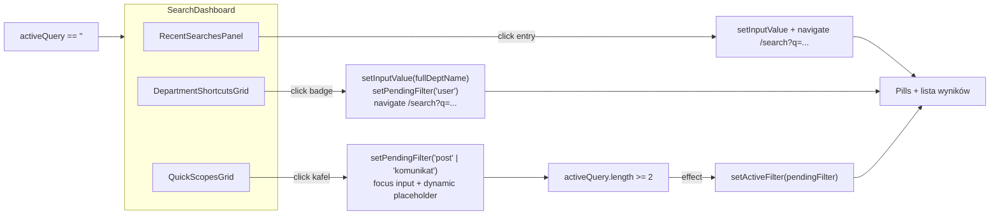

# Glass Search Dashboard — Empty State Revolution

## 1. Architektura i przepływ danych

Empty-state pulpit montujemy w `[src/components/SearchPageView.tsx](src/components/SearchPageView.tsx)` w miejscu obecnej karty "Ostatnio wyszukiwane" + przerywanej karty hint (linie 236–343). Trzy panele renderujemy gdy `activeQuery.trim().length < 2`. Sekcja wyników i pigułki filtrów pozostają nietknięte.



Kluczowa zmiana logiczna w `SearchPageView`: nowy stan `pendingFilter: ContentFilter | null`. Quick Scope i Department shortcut go ustawiają; po pierwszym przejściu `activeQuery` do >= 2 znaków `useEffect` aplikuje go do `activeFilter` i czyści. Bez `pendingFilter` zachowanie pozostaje jak dziś (reset do `'all'` przy zmianie URL).

## 2. Tokeny stylu — Glassmorphism & Gold

Dodajemy nowy blok `SEARCH_DASHBOARD` w `[src/styles/mobile-theme.ts](src/styles/mobile-theme.ts)` (plik już hostuje `OMNI_DESKTOP`, `PROFILE_MOBILE` itp. — to jedyne źródło prawdy dla rich tokenów). Bazujemy na wzorach z `PROFILE_MOBILE.card.glassClass` i `OMNI_DESKTOP.panel`.

Kluczowe klasy panelu (każdy panel = ten sam fundament + lokalna treść):

```ts
panel:
  'relative overflow-hidden rounded-2xl border backdrop-blur-xl backdrop-saturate-150 ' +
  'border-zinc-200/70 bg-white/70 shadow-[0_18px_60px_-30px_rgba(15,23,42,0.35)] ' +
  'dark:border-white/10 dark:bg-zinc-900/40 dark:shadow-[0_22px_80px_-35px_rgba(0,0,0,0.85)]',
panelInnerGlow:
  // wewnętrzny gradient u góry — efekt "polerowanego szkła"
  'before:pointer-events-none before:absolute before:inset-px before:rounded-[15px] ' +
  'before:bg-gradient-to-b before:from-white/[0.08] before:via-transparent before:to-transparent',
panelInteractive:
  'transition-all duration-300 ease-out ' +
  'hover:scale-[1.01] hover:border-[#1e293b]/35 hover:bg-white/85 ' +
  'dark:hover:border-brand-gold-bright/40 dark:hover:bg-zinc-900/55 ' +
  'dark:hover:shadow-[0_0_36px_-12px_rgba(232,200,74,0.32)]',
sectionTitle:
  'text-[10px] font-bold uppercase tracking-[0.22em] text-[#1e293b] dark:text-brand-gold-bright',
sectionSubtle:
  'text-[11px] font-semibold uppercase tracking-[0.18em] text-zinc-500 ' +
  'transition-colors hover:text-[#1e293b] dark:hover:text-brand-gold-bright',
```

Kafle (Quick Scope + Department) używają tej samej bazy `panel`, ale w wariancie z fixed-height i `panelInteractive`. Złoty akcent dla "hot" stanu (focus / active): `border-amber-500/45 bg-amber-500/[0.06]` w trybie dark, `border-[#1e293b]/45 bg-[#1e293b]/[0.05]` w light.

## 3. Nowa architektura pulpitu

### 3.A Recent Searches — kompaktowa, hover-reveal X

Zamiast obecnych pigułek z widocznym X, każdy chip ma:
- Małą `Clock` (lucide) po lewej (`size={12}`, `text-zinc-400 dark:text-zinc-500`).
- Tekst frazy.
- Przycisk X widoczny tylko po `group-hover` (`opacity-0 group-hover:opacity-100 transition-opacity duration-200`) — wzorzec już używany w `OMNI_DESKTOP.recentRemove`.
- Hover całego chipa: subtelny gold border `hover:border-[#1e293b]/30 dark:hover:border-brand-gold-bright/35`.

Nagłówek panelu z przyciskiem "WYCZYŚĆ" — używa `SEARCH_DASHBOARD.sectionSubtle`, bez tła, jako szklany text-button (już zbliżone do obecnej implementacji w linii 244–248, ale tracking i hover-color zostają wyrównane do tokenu).

Pusta historia: krótka linia `Brak ostatnich wyszukiwań — zacznij od kafla obok` (pointer do sekcji Quick Scopes).

### 3.B Quick Scopes — preseed filter + focus

Dwa kafle bento (`grid grid-cols-1 sm:grid-cols-2 gap-3`), każdy o stałej wysokości `h-28`. Dane jako lokalna stała:

```ts
const QUICK_SCOPES = [
  {
    id: 'post' as const,
    label: 'Wpisy Studentów',
    description: 'Przeglądaj posty społeczności UJ',
    icon: MessageSquare,                // import dopisany do listy lucide
    placeholder: 'Szukaj wśród wpisów studentów…',
  },
  {
    id: 'komunikat' as const,
    label: 'Oficjalne Komunikaty',
    description: 'Wyszukaj w komunikatach uczelnianych',
    icon: Megaphone,                    // już importowany
    placeholder: 'Szukaj wśród oficjalnych komunikatów…',
  },
] satisfies ReadonlyArray<{
  id: ContentFilter; label: string; description: string;
  icon: typeof MessageSquare; placeholder: string
}>
```

Handler `handleQuickScopeClick(scope)`:
1. `setPendingFilter(scope.id)`
2. `setDynamicPlaceholder(scope.placeholder)` (nowy stan, lub trzymany w `pendingFilter` przez derived selector mapujący id → placeholder)
3. `searchInputRef.current?.focus()` (wprowadzamy nowy `useRef<HTMLInputElement>` na input wyszukiwania)
4. **Bez** zmiany URL i bez wpisywania treści — input zostaje pusty, ale aktywny.

Po wpisaniu pierwszych 2 znaków `useEffect([activeQuery, pendingFilter])` aplikuje filter i czyści `pendingFilter`. Dzięki temu: kliknięcie → fokus → pisanie → wyniki już posortowane wg wybranego scope'u. Zero nowych endpointów, zero modyfikacji `useContentSearch`.

Layout kafla (klasy):
- root: `${panel} ${panelInteractive} group flex flex-col justify-between p-5 text-left`
- ikona: `inline-flex h-10 w-10 items-center justify-center rounded-xl bg-[#1e293b]/[0.06] text-[#1e293b] dark:bg-brand-gold-bright/10 dark:text-brand-gold-bright transition-colors group-hover:bg-[#1e293b]/10 dark:group-hover:bg-brand-gold-bright/15`
- tytuł: `text-base font-semibold text-zinc-800 dark:text-zinc-100`
- opis: `text-xs text-zinc-500 dark:text-zinc-400`

Wizualny stan "preseed active" (kiedy `pendingFilter === scope.id` i input pusty): dodatkowo border złoty + delikatna aureola `shadow-[0_0_24px_-8px_rgba(232,200,74,0.35)]`.

### 3.C Department Shortcuts — pełna siatka 17 wydziałów

Bazujemy na `UJ_DEPARTMENTS` z `[src/lib/departments.ts](src/lib/departments.ts)`. Iterujemy 17 wpisów, pokazując `DEPT_SHORT[dept]` jako etykietę i `getDeptAccent(dept).hex` jako kolorową kropkę po lewej.

Render każdego badge'a:

```tsx
<button
  className="group flex items-center gap-2 rounded-full border border-zinc-200/70 bg-white/55 px-3.5 py-1.5
             text-xs font-semibold text-zinc-700 backdrop-blur-md
             transition-all duration-200 hover:scale-[1.03]
             hover:border-[#1e293b]/35 hover:bg-white/80
             dark:border-white/10 dark:bg-white/[0.04] dark:text-zinc-200
             dark:hover:border-brand-gold-bright/45 dark:hover:bg-brand-gold-bright/10
             dark:hover:text-brand-gold-bright
             dark:hover:shadow-[0_0_18px_-8px_var(--dept-glow)]"
  style={{ ['--dept-glow' as any]: accent.glowRgba }}
  onClick={() => handleDepartmentClick(dept)}
  title={dept}
>
  <span aria-hidden className="h-2 w-2 rounded-full" style={{ background: accent.hex }} />
  {DEPT_SHORT[dept] ?? dept}
</button>
```

Wrapper: `flex flex-wrap gap-2` — naturalne wijące się rzędy w jednym szklanym panelu.

Handler `handleDepartmentClick(dept)`:
1. `setInputValue(dept)` — pełna nazwa (Meilisearch typotolerance + indexowane pole `department` wyciąga matche).
2. `setPendingFilter('user')` — po stronie wyników najpierw pokaże się pigułka "Użytkownicy".
3. `pushHistory(dept)` + `navigate('/search?q=' + encodeURIComponent(dept))`.

To **nie wymaga** zmian w `[src/hooks/useContentSearch.ts](src/hooks/useContentSearch.ts)` ani w `[src/services/SearchService.ts](src/services/SearchService.ts)` — `searchUnified` już używa `attributesToHighlight: ['fullName','username','department']` na indeksie `USERS_INDEX`.

> Uwaga o nazewnictwie: użytkownik wymienił `WFZ`/`WPiA`; w `DEPT_SHORT` faktyczne klucze to `WFz`, `WFAIS`, `WP`. Plan trzyma się istniejących wartości z `lib/departments.ts`, żeby nie wprowadzać driftu — wszystkie 17 skrótów renderują się dokładnie tak, jak są w lib.

## 4. Refactor `SearchPageView.tsx` — zakres zmian

- Dodajemy importy: `Clock`, `MessageSquare` (lucide).
- Dodajemy `useRef<HTMLInputElement>` dla inputa szukania (linijka ~159 dostaje `ref={searchInputRef}`).
- Nowy stan: `const [pendingFilter, setPendingFilter] = useState<ContentFilter | null>(null)`.
- `useEffect` przy URL-resecie (linie 54–58) — zachowuje obecny reset `activeFilter='all'`, ale **nie zeruje** `pendingFilter` jeśli zaaplikowany ma sens dla nowego query. Najprostsza wersja: zeruje pendingFilter także, a aplikacja dzieje się w odrębnym efekcie:

```ts
useEffect(() => {
  if (pendingFilter && activeQuery.trim().length >= 2) {
    setActiveFilter(pendingFilter)
    setPendingFilter(null)
  }
}, [activeQuery, pendingFilter])
```

- Placeholder inputa: `pendingFilter ? QUICK_SCOPE_PLACEHOLDER[pendingFilter] : 'Szukaj wpisów, komunikatów i użytkowników...'`.
- Usuwamy stary panel "Ostatnio wyszukiwane" (236–284) i panel "Wpisz co najmniej 2 znaki" (286–292). Cały empty-state przenosimy do nowego komponentu `<SearchDashboard … />`.

Nowy plik `src/components/search/SearchDashboard.tsx` (jeden plik, trzy lokalne sekcje + token-tylko styles), props:

```ts
type SearchDashboardProps = {
  history: string[]
  pendingFilter: ContentFilter | null
  onPickHistory: (entry: string) => void
  onRemoveHistory: (entry: string) => void
  onClearHistory: () => void
  onPickScope: (scope: ContentFilter) => void
  onPickDepartment: (dept: string) => void
}
```

Komponent renderuje 3 panele wewnątrz `motion.div` ze staggerem (sekcja 5). `SearchPageView` zostaje świadom logiki (handlery), `SearchDashboard` tylko prezentuje + emituje eventy.

Sekcja wyników (`activeQuery.length >= 2` w obecnym kodzie linie 286–343) zostaje **bez zmian** — żadne renderowanie listy wyników się nie zmienia. Dashboard wchodzi tylko w gałąź pustego inputa.

## 5. Animacja wejścia — kaskada

Reużywamy istniejące tokeny ruchu — najlepiej dopasowane jakościowo `OMNI_DESKTOP.motion`:

- Kontener panela dashboardu: `OMNI_DESKTOP.motion.staggerContainer` (delayChildren 0.02, staggerChildren 0.025) opakowany w nowy lekki preset `SEARCH_DASHBOARD.motion.section`:

```ts
motion: {
  container: {
    hidden: {},
    show: { transition: { staggerChildren: 0.08, delayChildren: 0.04 } },
  },
  section: {
    hidden: { opacity: 0, y: 12 },
    show: {
      opacity: 1, y: 0,
      transition: { duration: 0.45, ease: [0.16, 1, 0.3, 1] as const },
    },
  },
  chip: {
    hidden: { opacity: 0, y: 6 },
    show: {
      opacity: 1, y: 0,
      transition: { type: 'spring' as const, stiffness: 320, damping: 28 },
    },
  },
},
```

- Trzy `motion.section` jako dzieci (History → Quick Scopes → Departments) z `variants={section}` — daje kaskadę ~80ms.
- Wewnątrz Department panel: drugi `motion.div` z `staggerContainer` o `staggerChildren: 0.018`, dziecko `variants={chip}` — 17 badge'ów wchodzi falą.
- `AnimatePresence mode="wait"` wokół całego dashboardu w `SearchPageView`, aby przejście „dashboard ↔ wyniki" było płynne (current dashed-card znika obecnie bez animacji).

## 6. Interakcje — hover, focus, microscale

- Panele i kafle: `transition-all duration-300 ease-out`, `hover:scale-[1.01]`, hover border ku złotu, hover bg ciemniejsze szkło (jak w `panelInteractive` wyżej).
- Department badge: stronger `hover:scale-[1.03]`, dynamiczna złota poświata `--dept-glow` ustawiona inline-style z `getDeptAccent(dept).glowRgba` — daje subtelny per-wydziałowy akcent BEZ kolorowania całego badge'a (pure black/grafit estetyka utrzymana).
- Focus visible: zachowujemy `focus-visible:ring-2 focus-visible:ring-[#1e293b]/40 dark:focus-visible:ring-brand-gold-bright/45` — pattern obecny już w `SearchPageView` linie 203–204.
- Recent chip: X widoczny tylko on hover (`opacity-0 group-hover:opacity-100`), klawiaturowo dostępny via `focus-visible:opacity-100` (a11y).

## 7. Co NIE jest zmieniane

- `[src/hooks/useContentSearch.ts](src/hooks/useContentSearch.ts)` — brak zmian.
- `[src/services/SearchService.ts](src/services/SearchService.ts)` — brak zmian (dept filter już istnieje, ale dla tego planu używamy tylko query-based search po nazwie wydziału).
- `[src/lib/searchHistory.ts](src/lib/searchHistory.ts)` — brak zmian, używamy istniejących `pushHistoryEntry`, `removeHistoryEntry`, `clearAllHistory`.
- `[src/lib/departments.ts](src/lib/departments.ts)` — brak zmian, używamy `UJ_DEPARTMENTS`, `DEPT_SHORT`, `getDeptAccent`.
- Mobilna ścieżka (`SearchBar.tsx`) — nietknięta; dashboard jest wyłącznie dla desktopowej strony `/search`.
- Filtr pigułek (`FILTER_TABS`) i sekcja wyników — nietknięta.

## 8. Lista plików do edycji

- Edycja: `[src/components/SearchPageView.tsx](src/components/SearchPageView.tsx)` — dodanie `pendingFilter`, `searchInputRef`, dynamiczny placeholder, podmiana sekcji empty-state na `<SearchDashboard />`, efekt apply-pending-filter.
- Edycja: `[src/styles/mobile-theme.ts](src/styles/mobile-theme.ts)` — nowy eksport `SEARCH_DASHBOARD` z klasami i `motion`.
- Nowy plik: `src/components/search/SearchDashboard.tsx` — trzy sekcje (Recent / QuickScopes / Departments) w jednym pliku, props czysto prezentacyjne.

Po zaakceptowaniu planu wchodzimy w implementację w tej kolejności: (1) tokeny, (2) nowy komponent, (3) podpięcie do `SearchPageView` + nowy efekt `pendingFilter`.