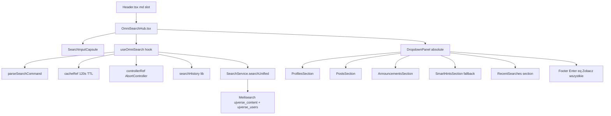

# Omni-Search Hub v2 — plan inżynierski

Strategia: **coexist**. Mobile (<768 px) korzysta dalej z istniejącego full-screen [`SearchBar.tsx`](src/components/SearchBar.tsx). Desktop (`md:`) dostaje nowy inline-input z absolute-positioned dropdownem zakotwiczonym w [`Header.tsx`](src/components/Header.tsx). Sekcje domyślne: Profile → Posty → Komunikaty.



---

## 1. Lokalizacja plików

### Nowe pliki

- [`src/components/OmniSearchHub.tsx`](src/components/OmniSearchHub.tsx) — główny komponent (desktop-only, `hidden md:flex`). Renderuje `SearchInputCapsule` + absolute `DropdownPanel`. Łączy wszystkie 6 systemów przez `useOmniSearch`.
- [`src/hooks/useOmniSearch.ts`](src/hooks/useOmniSearch.ts) — logika: stan, debounce, abort, cache, historia, parsowanie komend, derywacja `parsed`. Eksportuje typowane API.
- [`src/lib/searchCommands.ts`](src/lib/searchCommands.ts) — czysta funkcja `parseSearchCommand(raw): ParsedCommand` (testowalna bez Reacta).
- [`src/lib/searchHints.ts`](src/lib/searchHints.ts) — stała `ACADEMIC_HINTS` (Sesja, Stypendia, Dziekanat, USOS, Legitymacje) z mapowaniem na `lucide-react`.
- [`src/lib/searchHistory.ts`](src/lib/searchHistory.ts) — wspólny moduł `localStorage` (`HISTORY_KEY = 'ujverse_search_history_v1'`, `MAX_HISTORY = 12`, `RECENT_VISIBLE = 3`); eliminuje duplikację z [`SearchBar.tsx:59-111`](src/components/SearchBar.tsx) i [`SearchPageView.tsx:9-39`](src/components/SearchPageView.tsx).

### Modyfikacje

- [`src/components/Header.tsx`](src/components/Header.tsx) — w bloku `<div className="hidden md:flex items-center gap-0.5 shrink-0">` (linia 152) **przed** przyciskiem `CalendarDays` wstawić `<OmniSearchHub … />`; **usunąć** desktopowy przycisk lupy (linie 239–246). Mobile-only ikona z `SEARCH_MOBILE.triggerButtonClass` zostaje, ale w `SearchBar.tsx` ukrywamy desktopowy overlay (linie 957–964 — desktopowy `<button>` lupy do usunięcia, mobile zostaje).
- [`src/components/SearchBar.tsx`](src/components/SearchBar.tsx) — opcjonalnie: usunąć **desktopowy** branch (Ctrl+K listener na desktopie, `desktopOverlayOpen` state + cały createPortal #1, linie 967–1046) skoro funkcję przejmuje `OmniSearchHub`. **Mobile (`mobileModalOpen`) zostaje 1:1.** Refaktor historii na `src/lib/searchHistory.ts`.
- [`src/components/SearchPageView.tsx`](src/components/SearchPageView.tsx) — przepiąć duplikowane helpers historii na `src/lib/searchHistory.ts` (zero zmian funkcjonalnych).
- [`src/styles/mobile-theme.ts`](src/styles/mobile-theme.ts) — dopisać nowy blok `OMNI_DESKTOP = { … } as const` (tokeny tylko Tailwind class strings, zgodnie z patternem `SEARCH_MOBILE`).

### Bez zmian

- [`src/services/SearchService.ts`](src/services/SearchService.ts) — `searchUnified({ includeContent, includeUsers, userDepartmentFilter, signal, limit })` już ma wszystko czego potrzeba.
- [`src/lib/meilisearchClient.ts`](src/lib/meilisearchClient.ts), [`src/hooks/useContentSearch.ts`](src/hooks/useContentSearch.ts), [`src/App.tsx`](src/App.tsx) (callback `onNavigateToSearch` z linii 1227–1234 dalej działa jako "Zobacz wszystkie wyniki").

---

## 2. Architektura stanu (`useOmniSearch`)

### Typy

```ts
type OmniMode = 'all' | 'profiles' | 'komunikaty'

type ParsedCommand = {
  mode: OmniMode
  stripped: string
  action: 'theme-dark' | 'theme-light' | null
}

type OmniResults = {
  profiles: SearchUserHit[]
  posts: SearchHit[]
  announcements: SearchHit[]
}

type CacheEntry = { results: OmniResults; expiresAt: number }
```

### Stan w hooku

| Klucz | Typ | Cel |
|---|---|---|
| `query` | `string` | surowa wartość inputu (z `/p`, `/k`, `/ciemny`) |
| `parsed` | `ParsedCommand` (memo) | derived przez `parseSearchCommand(query)` — System 5 |
| `isOpen` | `boolean` | czy dropdown widoczny |
| `activeIndex` | `number` (-1 = brak) | flat-index po wszystkich wierszach wszystkich sekcji |
| `results` | `OmniResults` | max 5 per sekcja |
| `isLoading` | `boolean` | spinner w panelu |
| `error` | `string \| null` | błąd Meilisearch |
| `history` | `string[]` | top 3 z `localStorage` (System 4) |

### Refy (poza re-renderem)

- `cacheRef: Map<string, CacheEntry>` — klucz `${parsed.mode}:${stripped.toLowerCase()}`, TTL 120 000 ms (System 6).
- `controllerRef: AbortController | null` — anulowanie poprzedniego in-flight zapytania (System 6).
- `debounceRef: number | null` — handle `setTimeout`, 180 ms (System 1, w przedziale 150–200 ms).
- `activeIndexRef: number` — sync z `activeIndex` dla closures w `onKeyDown` bez zależności.
- `inputRef: RefObject<HTMLInputElement>` — programatyczny focus dla Ctrl+K.

### Reguły indeksu klawiatury (System 2)

Flat-list w stałej kolejności wizualnej: `profiles[0..N-1]` → `posts[0..M-1]` → `announcements[0..K-1]`. `totalCount = profiles.length + posts.length + announcements.length`.

- `ArrowDown`: `i => (i < 0 ? 0 : (i + 1) % totalCount)`
- `ArrowUp`: `i => (i < 0 ? totalCount - 1 : (i - 1 + totalCount) % totalCount)`
- `Home`/`End` → 0 / `totalCount - 1`
- `Enter`:
  - jeśli `activeIndex >= 0` → otwórz dopasowany element (`onNavigateToUser` / `onNavigateToPost` / `onNavigateToEvents`).
  - jeśli `activeIndex === -1` i `query.trim().length >= 2` → `onNavigateToSearch(query)` (route `/search?q=…`) + `pushHistoryEntry`.
  - jeśli query puste → no-op.
- `Escape` → `setIsOpen(false); inputRef.current?.blur()`.
- Reset `activeIndex` na każdą zmianę `query` lub `results` (analogicznie do [`SearchBar.tsx:315-317`](src/components/SearchBar.tsx)).
- Scroll-into-view dla aktywnego wiersza przez `data-omni-row-index={idx}` (wzorzec z [`SearchBar.tsx:324-328`](src/components/SearchBar.tsx)).

### Efekt główny — debounce + abort + cache (System 6)

```ts
useEffect(() => {
  if (parsed.action) return
  const q = parsed.stripped.trim()
  if (q.length < 2) { setResults(EMPTY); setIsLoading(false); return }

  const key = `${parsed.mode}:${q.toLowerCase()}`
  const cached = cacheRef.current.get(key)
  if (cached && cached.expiresAt > Date.now()) {
    setResults(cached.results); setIsLoading(false); return
  }

  controllerRef.current?.abort()
  controllerRef.current = new AbortController()
  const signal = controllerRef.current.signal
  if (debounceRef.current) window.clearTimeout(debounceRef.current)
  setIsLoading(true)

  debounceRef.current = window.setTimeout(async () => {
    try {
      const { content, users } = await SearchService.searchUnified(q, {
        signal,
        limit: 5,
        includeContent: parsed.mode !== 'profiles',
        includeUsers: parsed.mode !== 'komunikaty',
      })
      if (signal.aborted) return
      const next: OmniResults = {
        profiles: parsed.mode === 'komunikaty' ? [] : users.slice(0, 5),
        posts: parsed.mode === 'komunikaty' || parsed.mode === 'profiles'
          ? (parsed.mode === 'komunikaty' ? [] : [])
          : content.filter(c => c.type === 'post').slice(0, 5),
        announcements: parsed.mode === 'profiles'
          ? []
          : content.filter(c => c.type === 'komunikat').slice(0, 5),
      }
      cacheRef.current.set(key, { results: next, expiresAt: Date.now() + 120_000 })
      setResults(next)
    } catch (err) {
      if (signal.aborted) return
      setResults(EMPTY); setError('Błąd wyszukiwania')
    } finally {
      if (!signal.aborted) setIsLoading(false)
    }
  }, 180)

  return () => { /* następny run zaaboruje aktualny przez controllerRef */ }
}, [parsed.stripped, parsed.mode, parsed.action])
```

### Efekt komend instant (System 5)

```ts
useEffect(() => {
  if (parsed.action === 'theme-dark' && theme !== 'dark') toggleTheme()
  if (parsed.action === 'theme-light' && theme !== 'light') toggleTheme()
  if (parsed.action) { setQuery(''); setIsOpen(false) }
}, [parsed.action])
```

### Parser komend ([`src/lib/searchCommands.ts`](src/lib/searchCommands.ts))

```ts
export function parseSearchCommand(raw: string): ParsedCommand {
  const t = raw.trimStart()
  if (/^\/ciemny\b/i.test(t))  return { mode: 'all',        stripped: '', action: 'theme-dark' }
  if (/^\/jasny\b/i.test(t))   return { mode: 'all',        stripped: '', action: 'theme-light' }
  if (/^\/p(\s+|$)/i.test(t))  return { mode: 'profiles',   stripped: t.replace(/^\/p\s*/i, ''), action: null }
  if (/^\/k(\s+|$)/i.test(t))  return { mode: 'komunikaty', stripped: t.replace(/^\/k\s*/i, ''), action: null }
  return { mode: 'all', stripped: raw, action: null }
}
```

### Ctrl/Cmd+K — globalny listener

Wzorzec z [`SearchBar.tsx:258-279`](src/components/SearchBar.tsx) (filtrowanie `INPUT`/`TEXTAREA`/`contentEditable` poza naszym inputem), ale zamiast `setDesktopOverlayOpen` wywołuje `setIsOpen(true) + inputRef.current?.focus()`. Listener tylko gdy `window.matchMedia('(min-width: 768px)').matches` — żeby nie kolidować z mobilnym `SearchBar.tsx`.

---

## 3. Specyfikacja UI/UX (tokeny Tailwind w `OMNI_DESKTOP`)

### Kapsuła inputa (zawsze widoczna w headerze md:)

```ts
inputCapsuleWrap:
  'relative h-9 lg:h-10 w-64 lg:w-80 xl:w-96 shrink-0 ' +
  'flex items-center rounded-2xl px-3.5 backdrop-blur-md backdrop-saturate-150 ' +
  'border border-zinc-200 bg-white/80 transition-colors duration-200 ' +
  'focus-within:border-[#1e293b]/40 ' +
  'dark:border-white/10 dark:bg-bg-card/80 dark:focus-within:border-brand-gold-bright/45'
inputInner:
  'h-full w-full bg-transparent text-sm text-zinc-800 outline-none placeholder:text-zinc-500 ' +
  'caret-[#1e293b] dark:text-zinc-100 dark:placeholder:text-zinc-500 dark:caret-brand-gold-bright'
modeBadge: // chip "/p" / "/k" przy lewej krawędzi po sparsowaniu komendy
  'mr-2 inline-flex items-center gap-1 rounded-md border border-[#1e293b]/30 bg-[#1e293b]/8 px-1.5 py-0.5 ' +
  'text-[10px] font-bold uppercase tracking-wider text-[#1e293b] ' +
  'dark:border-brand-gold-bright/40 dark:bg-brand-gold-bright/10 dark:text-brand-gold-bright'
kbdHint: // "⌘K" / "Ctrl K" przy prawej krawędzi gdy `!isOpen`
  'pointer-events-none ml-2 hidden lg:inline-flex items-center gap-1 text-[10px] font-mono ' +
  'text-zinc-400 dark:text-zinc-500'
```

### Pływający panel (System 1 — glassmorfizm)

```ts
panel:
  'absolute right-0 top-[calc(100%+0.5rem)] z-[120] w-[min(28rem,calc(100vw-2rem))] ' +
  'origin-top-right overflow-hidden rounded-2xl ' +
  'border border-zinc-200/80 bg-white/95 shadow-2xl shadow-black/15 ring-1 ring-black/[0.04] ' +
  'backdrop-blur-2xl backdrop-saturate-150 ' +
  'dark:border-white/10 dark:bg-black/80 dark:shadow-black/60 dark:ring-white/[0.06]'
panelInner: 'max-h-[min(70vh,560px)] overflow-y-auto overscroll-contain'
sectionHeader:
  'flex items-center gap-2 px-4 pt-3 pb-1.5 ' +
  'text-[10px] font-bold uppercase tracking-[0.18em] text-slate-500 dark:text-brand-gold-bright'
sectionDivider: 'mt-1 border-t border-zinc-200/70 dark:border-white/10'
```

### Wiersz wyniku (hover/active/highlight)

```ts
rowBase:
  'flex w-full items-center gap-3 mx-2 px-2 py-2 rounded-xl cursor-pointer text-left ' +
  'transition-colors duration-150'
rowHover:
  'hover:bg-zinc-100/80 dark:hover:bg-white/[0.06] ' +
  'active:bg-zinc-200/70 dark:active:bg-white/[0.08]'
rowActive: // System 2: ArrowDown/Up highlight — złoty ring w darku
  'bg-zinc-100/90 ring-1 ring-inset ring-[#1e293b]/25 ' +
  'dark:bg-brand-gold/10 dark:ring-brand-gold-bright/35'
rowTitle: 'block truncate text-sm font-semibold text-zinc-800 dark:text-zinc-100'
rowMeta:  'block truncate text-xs text-zinc-500 dark:text-slate-400'
rowSnippet: 'block line-clamp-2 text-sm text-zinc-700 dark:text-slate-300'
```

### Recent searches (System 4)

```ts
recentRow:
  'group flex items-center gap-2 px-3 py-2 mx-2 rounded-xl ' +
  'hover:bg-zinc-100/80 dark:hover:bg-white/[0.05]'
recentClock: 'shrink-0 text-zinc-400 dark:text-zinc-500'   // Clock size=14
recentText:  'flex-1 truncate text-sm text-zinc-700 dark:text-zinc-200'
recentRemove:
  'shrink-0 rounded-md p-1.5 text-zinc-400 opacity-0 group-hover:opacity-100 ' +
  'transition-opacity hover:text-zinc-700 dark:text-zinc-500 dark:hover:text-zinc-200'
```

### Smart-hint chips (System 3)

```ts
hintsWrap:    'flex flex-wrap gap-2 px-4 pb-3 pt-2'
hintChipBase:
  'inline-flex items-center gap-1.5 rounded-full border px-3 py-1.5 ' +
  'text-xs font-medium transition-colors ' +
  'border-zinc-200 bg-white/70 text-zinc-700 ' +
  'hover:border-[#1e293b]/35 hover:bg-zinc-100 ' +
  'dark:border-white/15 dark:bg-white/[0.04] dark:text-zinc-200 ' +
  'dark:hover:border-brand-gold-bright/45 dark:hover:bg-brand-gold-bright/10'
hintIcon: 'shrink-0 text-[#1e293b] dark:text-brand-gold-bright'
```

### Stopka (System 1 — "Zobacz wszystkie wyniki")

```ts
footer:
  'sticky bottom-0 flex items-center justify-between border-t border-zinc-200/80 ' +
  'bg-zinc-50/80 px-4 py-2.5 backdrop-blur-md ' +
  'dark:border-white/10 dark:bg-black/60'
footerLabel:  'text-[11px] text-slate-500 dark:text-slate-400'
footerEnter:  // "Wciśnij Enter" w stylu kbd
  'inline-flex items-center gap-1.5 rounded-md border border-zinc-300 bg-white px-1.5 py-0.5 ' +
  'text-[10px] font-mono text-zinc-700 shadow-sm ' +
  'dark:border-white/15 dark:bg-white/[0.06] dark:text-zinc-300'
```

### Animacje Framer Motion (rozwijanie dropdowna)

```ts
panelMotion: {
  initial: { opacity: 0, y: -8, scale: 0.985 },
  animate: { opacity: 1, y: 0, scale: 1 },
  exit:    { opacity: 0, y: -6, scale: 0.985 },
  transition: { duration: 0.18, ease: [0.16, 1, 0.3, 1] as const },
}
staggerContainer: { hidden: {}, show: { transition: { staggerChildren: 0.025, delayChildren: 0.02 } } }
staggerItem: {
  hidden: { opacity: 0, y: 6 },
  show:   { opacity: 1, y: 0, transition: { type: 'spring' as const, stiffness: 320, damping: 28 } },
}
```

---

## 4. Architektura kodu (makieta JSX/TSX)

### `OmniSearchHub.tsx` — szkielet

```tsx
import { useRef } from 'react'
import { AnimatePresence, motion } from 'framer-motion'
import { Clock, Search, X } from 'lucide-react'
import { useOmniSearch } from '../hooks/useOmniSearch'
import { useTheme } from '../ThemeContext'
import { ACADEMIC_HINTS } from '../lib/searchHints'
import { OMNI_DESKTOP as T } from '../styles/mobile-theme'
import UserAvatar from './UserAvatar'

type Props = {
  onNavigateToUser: (userId: string) => void
  onNavigateToPost: (postId: string) => void
  onNavigateToEvents: () => void
  onNavigateToSearch: (query?: string) => void
}

export default function OmniSearchHub(props: Props) {
  const containerRef = useRef<HTMLDivElement>(null)
  const inputRef = useRef<HTMLInputElement>(null)
  const o = useOmniSearch({ inputRef, ...props })   // hook własny wszystkich 6 systemów

  return (
    <div ref={containerRef} className="relative hidden md:flex">
      {/* === KAPSUŁA INPUTU ============================================= */}
      <div className={T.inputCapsuleWrap}>
        <Search size={16} strokeWidth={2}
          className="mr-2.5 shrink-0 text-[#1e293b] dark:text-zinc-400" />
        {o.parsed.mode !== 'all' && (
          <span className={T.modeBadge}>{o.parsed.mode === 'profiles' ? '/p' : '/k'}</span>
        )}
        <input
          ref={inputRef}
          type="search"
          value={o.query}
          onChange={(e) => o.setQuery(e.target.value)}
          onFocus={o.open}
          onKeyDown={o.onKeyDown}
          placeholder="Szukaj w UJverse…"
          className={T.inputInner}
          autoComplete="off"
          spellCheck={false}
          aria-expanded={o.isOpen}
          aria-controls="omni-dropdown"
          aria-autocomplete="list"
        />
        {!o.isOpen && <kbd className={T.kbdHint}>⌘K</kbd>}
      </div>

      {/* === PŁYWAJĄCY PANEL ============================================ */}
      <AnimatePresence>
        {o.isOpen && (
          <motion.div
            id="omni-dropdown"
            role="listbox"
            className={T.panel}
            {...panelMotion}
          >
            <div className={T.panelInner}>
              {/* SYSTEM 4 — Recent (query === '') */}
              {o.query.length === 0 && <RecentBlock o={o} />}

              {/* SYSTEM 1 — Sekcje wyników (Profile + Posty + Komunikaty) */}
              {o.query.length >= 2 && o.hasResults && <ResultsBlock o={o} {...props} />}

              {/* Loader */}
              {o.isLoading && <LoadingState />}

              {/* SYSTEM 3 — Smart hints (0 hitów po search) */}
              {o.searched && !o.hasResults && <SmartHintsBlock onPick={o.setQuery} />}
            </div>

            {/* SYSTEM 1 — Stopka */}
            <DropdownFooter
              count={o.totalCount}
              onSeeAll={() => props.onNavigateToSearch(o.query)}
            />
          </motion.div>
        )}
      </AnimatePresence>
    </div>
  )
}
```

### Sekcje wewnętrzne (modularne, w tym samym pliku lub `src/components/search/`)

- `RecentBlock` — `o.history.slice(0, 3)`, klik → `setQuery(h) + focus`; X usuwa (`o.removeHistory(h)`). Klasy: `T.sectionHeader`, `T.recentRow`, `T.recentClock`, `T.recentRemove`.
- `ResultsBlock` — renderuje **w stałej kolejności** sekcje (Profile → Posty → Komunikaty), każda ukrywana gdy pusta lub gdy filter mode tę sekcję wyklucza. Każdy wiersz dostaje `data-omni-row-index={flatIdx++}` i klasę `T.rowActive` gdy `o.activeIndex === flatIdx`. Avatar Profile: `<UserAvatar>` (spójność z [`SearchBar.tsx:792-797`](src/components/SearchBar.tsx)).
- `SmartHintsBlock` — mapuje `ACADEMIC_HINTS` na `T.hintChipBase` + `T.hintIcon`.
- `DropdownFooter` — etykieta `Zobacz wszystkie wyniki` + `<kbd>` "Enter".

### Hook (`useOmniSearch`) — public API

```ts
return {
  // input
  query, setQuery,
  parsed,                  // { mode, stripped, action }
  // panel
  isOpen, open: () => setIsOpen(true), close: () => setIsOpen(false),
  // navigation
  activeIndex, onKeyDown,  // wbudowany ArrowDown/Up/Enter/Escape/Home/End
  // results
  results, isLoading, error,
  totalCount, hasResults, searched,
  // history
  history,                 // .slice(0, 3) do UI
  removeHistory, clearHistory,
  // refs do scrollIntoView
  rowRefSetter,
}
```

### Integracja z `Header.tsx`

```diff
 // src/components/Header.tsx (linie 152–246)
   <div className="hidden md:flex items-center gap-0.5 shrink-0">
+    <OmniSearchHub
+      onNavigateToUser={(id) => onNavigateToProfile() /* TODO route */}
+      onNavigateToPost={(id) => /* navigate(`/thread/${id}`) */}
+      onNavigateToEvents={onNavigateToEvents}
+      onNavigateToSearch={onNavigateToSearch}
+    />
     <button … aria-label="Wydarzenia">…</button>
-    <button … aria-label="Szukaj"><Search/></button>  {/* USUNĄĆ — linie 239–246 */}
```

`onNavigateToUser` na poziomie `App.tsx` istnieje już dla `SearchBar` (wzorzec z [`App.tsx:1227-1234`](src/App.tsx)); podpięcie analogiczne. Header dostanie 4 callbacki zamiast jednego `onNavigateToSearch`.

### Higiena lintera / TS

- Eksport komponentów wewnętrznych jako `function NazwaBlock(...)` (nie default) w tym samym pliku — łatwy tree-shaking, brak nadmiernej fragmentacji.
- `as const` na `OMNI_DESKTOP` (wzorzec z [`SEARCH_MOBILE`](src/styles/mobile-theme.ts)).
- Brak `any`. Typy: `OmniMode`, `ParsedCommand`, `OmniResults`, `CacheEntry`. `KeyboardEvent` z `react`.
- Brak nowych globalnych kontekstów (zgodnie z `architect.mdc` zasada #1).
- `useEffect` z poprawnymi zależnościami; aborty w cleanupach; brak race conditions (`signal.aborted` check po awaicie — wzorzec z [`SearchBar.tsx:347-389`](src/components/SearchBar.tsx)).
- Ctrl+K listener montowany tylko gdy `matchMedia('(min-width:768px)').matches` — zero kolizji z mobilnym `SearchBar.tsx`.

---

## 5. Mapowanie systemów → kod

- **System 1** (dropdown + debounce 180 ms + max 5 + stopka): `useOmniSearch` debounce + `SearchService.searchUnified({ limit: 5 })` + `<DropdownFooter>`.
- **System 2** (Ctrl/Cmd+K + Arrow nav + Enter + Escape): globalny listener w `useOmniSearch` + `onKeyDown` + `data-omni-row-index` scroll-into-view.
- **System 3** (smart hints): `SmartHintsBlock` renderowany gdy `searched && !hasResults`; chips z `ACADEMIC_HINTS`.
- **System 4** (recent searches, max 3): `RecentBlock` widoczny gdy `query === '' && isOpen`; źródło `searchHistory.ts` (LocalStorage `ujverse_search_history_v1`).
- **System 5** (`/p`, `/k`, `/ciemny`, `/jasny`): `parseSearchCommand` + efekt instant na `parsed.action` (toggleTheme + setQuery('')).
- **System 6** (AbortController + cache 120 s): `controllerRef.current?.abort()` przed każdym fetchem; `cacheRef: Map<string, CacheEntry>` z TTL.

---

## 6. Out of scope (świadomie odłożone)

- Mobile (<md): brak zmian funkcjonalnych — istniejący [`SearchBar.tsx`](src/components/SearchBar.tsx) `mobileModalOpen` zostaje.
- Synchronizacja Realtime cache (nie wymagana — TTL 120 s i abort wystarczy).
- Nowe migracje Supabase / RLS — bez zmian.
- Refaktor `useContentSearch` na `useOmniSearch` w [`SearchPageView.tsx`](src/components/SearchPageView.tsx) — strona dalej działa na swoim hooku.
- Telemetria/analytics dropdowna.