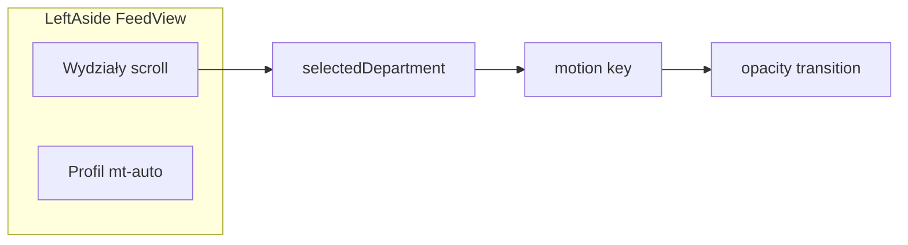

# Plan: Sidebar wydziałów + profil + animacja feedu

## Stan obecny

- Lewy panel desktopowy jest w `[src/components/FeedView.tsx](src/components/FeedView.tsx)`: dwa osobne bloki z `[sideCardCls](src/components/FeedView.tsx)` — **mini profil** (ok. 228–250) oraz **lista wydziałów** (252–274), z klasami `deptFilterActive` / `deptFilterInactive` (89–96).
- Filtrowanie: `selectedDepartment` w `[App.tsx](src/App.tsx)` przycina `posts` przed przekazaniem do `FeedView`; sama lista postów już używa `framer-motion` (`AnimatePresence` + `motion.div` per post, 179–217).
- `[src/components/DepartmentFilter.tsx](src/components/DepartmentFilter.tsx)` — poziomy pasek na `lg:hidden`; specyfikacja dotyczy głównie **desktopowego** sidebara (padding „na PC”).

## ETAP 1 — Jeden kontener sidebara

**Plik:** `[src/components/FeedView.tsx](src/components/FeedView.tsx)`

- Usunąć górny blok „Mini profile widget” (228–250).
- Zastąpić dwa `sideCardCls` jednym `<aside>` jako **pionowy panel**:
  - Klasy kontenera (propozycja, do dopasowania wizualnie): `bg-bg-app/50 backdrop-blur-xl`, zaokrąglenie np. `rounded-r-2xl`, **subtelna granica** względem kolumny feedu: `border-r border-border-app/30` (ew. `dark:border-white/[0.06]` jeśli w dark trzeba mocniej oddzielić).
  - Wewnętrzny układ: `flex flex-col min-h-0` + `overflow-y-auto custom-scrollbar` na scrollowalnej części (lista wydziałów), żeby przy długiej liście i sekcji profilu na dole nic nie wychodziło poza viewport (`max-h-[calc(100vh-8rem)]` zostaje na `aside` jak dziś).
- Sekcja **„Wydziały”** na samej górze tego panelu (nagłówek `sectionLabelCls` + lista przycisków) — bez osobnej „karty” wokół samej listy; ewentualnie jeden wspólny padding `px-4 py-4` dla całego panelu.

## ETAP 2 — Lista wydziałów + `image_f76a83.png`

**Plik:** `[src/components/FeedView.tsx](src/components/FeedView.tsx)` (lub wydzielony mały podkomponent w tym samym pliku, jeśli JSX urośnie).

- **Asset:** w repo **nie ma** pliku `image_f76a83.png` (sprawdzone: tylko `[public/logo.png](public/logo.png)`, `[public/icons.svg](public/icons.svg)`). Należy **dodać** `public/image_f76a83.png` (eksport z Figmy / Twoje źródło), wtedy w CSS/Tailwind: `url('/image_f76a83.png')`.
- **Hover:** każdy wiersz jako `relative overflow-hidden rounded-lg`; warstwa tła: np. `hover:bg-brand-gold/10` + delikatna tekstura (`background-image` z niską `opacity` na hover, `bg-cover` / `bg-center`, `pointer-events-none`), tekst: `hover:text-white` (dark) i/lub `hover:text-brand-gold-bright` zgodnie z kontrastem w obu motywach — tokeny już są w projekcie (`brand-gold`, `brand-gold-bright` w `[src/index.css](src/index.css)`).
- **Active:** dla wybranego wydziału (w tym „Wszystkie” gdy `selectedDepartment === ''`) — **pionowy pasek** po lewej: np. `absolute left-0 top-1/2 -translate-y-1/2 h-[60%] w-0.5 rounded-full bg-brand-gold` + dodatkowy `pl-3` na przycisku, żeby tekst nie nachodził na pasek; jednocześnie typografia aktywna: `text-brand-gold-bright` / `font-bold` spójnie z obecnym `deptFilterActive`.
- **Odstępy (PC):** zwiększyć `space-y-`* między przyciskami (np. z `0.5` na `1.5`–`2`) oraz `py` na każdym przycisku (np. `py-2.5` / `py-3`).

## ETAP 3 — Profil na dole (opcjonalnie, rekomendowane)

**Pliki:** `[src/components/FeedView.tsx](src/components/FeedView.tsx)`, `[src/App.tsx](src/App.tsx)`

- Na dole panelu: sekcja „User profile” — **mniejszy** `UserAvatar` + `displayName` (jak wcześniej, bez pełnej „karty”; opcjonalnie skrócona linia z wydziałem przez `getDeptAbbreviation`).
- Owinąć w `<button type="button">` lub użyć `role="link"` z obsługą klawiatury i wywołać nawigację do widoku profilu: dodać opcjonalną prop np. `onNavigateToProfile?: () => void` i w `App` przekazać `() => setActiveView('profile')` (ten sam cel co `[onNavigateToProfile` w `Header](src/App.tsx)` ok. 745).
- Wizualnie: `mt-auto`, `border-t border-border-app/20`, kompaktowy padding; nie duplikować logiki modala — samo przejście do `profile` wystarczy jak „wejście w profil”; edycja dalej z nagłówka/modala.

## ETAG 4 — Płynne przejście przy zmianie wydziału

**Plik:** `[src/components/FeedView.tsx](src/components/FeedView.tsx)`

- Owinąć **kontener listy postów** (wewnątrz `feedContent`, tam gdzie jest `AnimatePresence` z postami) w `motion.div` z `**key={selectedDepartment || '__all__'}`**, z animacją:
  - `initial={{ opacity: 0 }}`
  - `animate={{ opacity: 1 }}`
  - `exit={{ opacity: 0 }}` — wymaga `AnimatePresence` **wokół** tego wrappera (tryb `mode="wait"` lub `sync` — `wait` daje czytelniejsze krzyżowe zanikanie przy wymianie listy).
- Zachować istniejące animacje pojedynczych `PostCard` lub uprościć opóźnienia (`delay`), jeśli podwójna animacja będzie zbyt „ciężka” — priorytet: **wyraźne przyciemnienie całej listy przy zmianie filtra**, zgodnie z wymaganiem.

## Zakres poza zmianami

- **Mobile:** `DepartmentFilter` — bez zmian, chyba że zechcesz później wizualnie zsynchronizować z desktopem.
- **Prawy sidebar** (Niezbędnik / Wydarzenia) — bez zmian.
- **Nie edytować** `node_modules` ani generowanych plików.

## Ryzyka / uwagi

- Brak pliku graficznego blokuje wizualną część ETAPU 2 do czasu dodania `public/image_f76a83.png`.
- W trybie jasnym `hover:text-white` na jasnym tle może być nieczytelne — warto użyć warunków `dark:` lub `hover:text-fg-primary` + `dark:hover:text-white` razem z `hover:text-brand-gold-bright` tam, gdzie ma sens.

