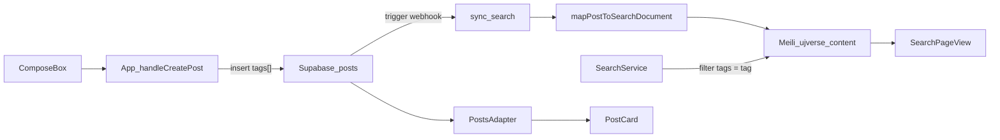

# Smart Tags — plan wdrożenia

## Kontekst (stan obecny)

- Tabela `posts` w migracji bootstrap ma `body`/`title`, ale **aplikacja** używa `content` + `image_url` ([`src/App.tsx`](src/App.tsx) insert/select). Kolumny `tags` **nie ma**.
- Indeksowanie Meili: webhook [`api/sync-search.ts`](api/sync-search.ts) + mapper [`lib/searchSyncMapper.ts`](lib/searchSyncMapper.ts). Dokument posta: `content`, `author`, `department` — **bez `tags`**.
- [`lib/meilisearchIndexSettings.ts`](lib/meilisearchIndexSettings.ts) konfiguruje tylko `ujverse_users`; dla `ujverse_content` **brak** `filterableAttributes`.
- Tworzenie posta: [`ComposeBox.tsx`](src/components/ComposeBox.tsx) jest prezentacyjny; **insert** jest w `handleCreatePost` w [`App.tsx`](src/App.tsx) (linie ~507–510).
- Wzorzec tagów istnieje tylko dla **klubów** (`UjverseSanitizer.normalizeTag` z prefiksem `#`) — posty mają używać **osobnej** funkcji bez `#` w DB.



---

## 1. Baza danych (Supabase migration)

**Nowy plik:** [`supabase/migrations/20260527120000_posts_tags.sql`](supabase/migrations/20260527120000_posts_tags.sql) (timestamp po ostatniej migracji `20260520120000`).

```sql
ALTER TABLE public.posts
  ADD COLUMN IF NOT EXISTS tags text[] NOT NULL DEFAULT '{}'::text[];

CREATE INDEX IF NOT EXISTS posts_tags_gin_idx
  ON public.posts USING GIN (tags);
```

- `IF NOT EXISTS` — bezpieczne przy ponownym deployu.
- Brak zmian RLS: `tags` podlega tym samym politykom co wiersz posta.
- **Backfill istniejących postów (opcjonalny skrypt SQL w migracji):** nie jest wymagany do działania nowych wpisów; stare posty będą miały `tags = {}` do czasu re-sync / ręcznego backfillu.

**Po deploy:** uruchomić [`scripts/backfill-search.ts`](scripts/backfill-search.ts) (lub `force-resync`) żeby zindeksować `tags` dla starych rekordów — tylko jeśli mają hashtagi w treści (backfill może też parsować `content` po stronie skryptu, patrz pkt. 4).

---

## 2. Warstwa typów i adapterów

| Plik | Zmiana |
|------|--------|
| [`src/types/index.ts`](src/types/index.ts) | `Post`: `tags?: string[] \| null` |
| [`src/types/content.ts`](src/types/content.ts) | `PostMeta`: `tags: string[]` |
| [`src/types/search.ts`](src/types/search.ts) | `SearchDocument`: `tags?: string[]` |
| [`lib/searchSyncMapper.ts`](lib/searchSyncMapper.ts) | `PostRecord.tags?`; `SearchContentDocument.tags?`; w `mapPostToSearchDocument` mapować znormalizowaną tablicę (pusta → `[]` lub pominąć pole) |
| [`src/services/adapters/PostsAdapter.ts`](src/services/adapters/PostsAdapter.ts) | W `toUnified`: `metadata.tags` z `raw.tags ?? []` (defensywnie filtrować puste stringi) |
| [`src/lib/normalizeSearchHits.ts`](src/lib/normalizeSearchHits.ts) | Przepuszczać `tags` z hitów Meili do `SearchHit` |

`select('*, profiles(...)')` w adapterze i `App.tsx` automatycznie pobierze `tags` po migracji — bez zmiany listy kolumn.

**Uwaga drift:** zduplikowany mapper w [`supabase/functions/_shared/searchMapper.ts`](supabase/functions/_shared/searchMapper.ts) — zsynchronizować pole `tags` (Edge function nadal obsługuje starszą ścieżkę webhooków).

---

## 3. Regex parsing (client-side)

**Nowy helper** [`src/lib/postTags.ts`](src/lib/postTags.ts):

```ts
const HASHTAG_RE = /#([a-zA-Z0-9_]+)/g

export function extractPostTags(text: string): string[] {
  const found: string[] = []
  for (const m of text.matchAll(HASHTAG_RE)) {
    if (m[1]) found.push(m[1].toLowerCase())
  }
  return [...new Set(found)]
}
```

**Integracja w [`src/App.tsx`](src/App.tsx)** (`handleCreatePost`), nie w samym ComposeBox (komponent nie zna treści przy submit poza props `body` — logika przy insert jest spójna z architekturą sesji w `App.tsx`):

```ts
const postContent = content || ''
const tags = extractPostTags(postContent)
await supabase.from('posts').insert([{
  content: postContent,
  image_url: imageUrl,
  user_id: userId,
  tags,
}])
```

- Hashtagi **zostają w treści** (`#ankieta` widoczne w body) — tagi w DB to denormalizacja do filtrowania.
- Nie używać `UjverseSanitizer.normalizeTag` (dodaje `#` i inny regex) — osobna funkcja dla postów.

---

## 4. Meilisearch — sync i konfiguracja indeksu

### 4a. Dokument w indeksie

W [`mapPostToSearchDocument`](lib/searchSyncMapper.ts):

```ts
tags: Array.isArray(record.tags)
  ? record.tags.map(t => t.trim().toLowerCase()).filter(Boolean)
  : [],
```

Webhook [`api/sync-search.ts`](api/sync-search.ts) przekazuje `record` z triggera — po migracji `tags` trafi automatycznie w payload INSERT/UPDATE.

### 4b. Ustawienia indeksu `ujverse_content`

Rozszerzyć [`lib/meilisearchIndexSettings.ts`](lib/meilisearchIndexSettings.ts):

```ts
export const CONTENT_INDEX_UID = 'ujverse_content'
export const CONTENT_FILTERABLE_ATTRIBUTES = [
  'type',
  'department',
  'tags',
  'announcementStatus',
] as const

export async function ensureContentIndexSettings(client: Meilisearch): Promise<void> {
  // createIndex if missing (primaryKey: 'id')
  await index.updateFilterableAttributes([...CONTENT_FILTERABLE_ATTRIBUTES]).waitTask()
}
```

Wywołać `ensureContentIndexSettings` z:
- [`api/sync-search.ts`](api/sync-search.ts) — lazy once (jak `ensureUsersIndexSettings`)
- [`scripts/backfill-search.ts`](scripts/backfill-search.ts) i [`scripts/force-resync.ts`](scripts/force-resync.ts) — przed upsertem

**Meili filter syntax** (tablica stringów): `tags = "ankieta"` zwraca dokumenty, gdzie tablica zawiera wartość.

### 4c. Backfill

[`scripts/backfill-search.ts`](scripts/backfill-search.ts):
- Dodać `tags` do `.select(...)`
- Preferowane: użyć `mapPostToSearchDocument` zamiast inline mapowania (jeden source of truth)
- Dla starych postów bez `tags` w DB: opcjonalnie `extractPostTags(content)` w skrypcie + opcjonalny batch UPDATE w Supabase (poza scope migracji — tylko w backfill)

---

## 5. UI — pigułki tagów (`PostCard`)

W [`src/components/PostCard.tsx`](src/components/PostCard.tsx), **po** paragrafie body, **przed** obrazkiem (~linia 285):

```tsx
{content.metadata.tags?.length > 0 && (
  <div className="mt-2 flex flex-wrap gap-1.5">
    {content.metadata.tags.map((tag) => (
      <span
        key={tag}
        className="rounded-full border border-brand-gold/30 bg-brand-gold/10 px-2 py-0.5 text-xs font-medium text-brand-gold dark:text-brand-gold-bright"
      >
        #{tag}
      </span>
    ))}
  </div>
)}
```

- Styl spójny z chipami w [`SearchPageView`](src/components/SearchPageView.tsx) / [`SEARCH_DASHBOARD`](src/styles/mobile-theme.ts).
- Klik w pigułkę (opcjonalnie w tej iteracji): `navigate('/search?q=%23' + tag)` — niskokosztowe, wspiera pkt. 6.

---

## 6. Filtrowanie w wyszukiwarce (`#tag`) — pełny zakres

### 6a. Parser zapytania

W [`src/lib/postTags.ts`](src/lib/postTags.ts) (lub [`src/lib/searchCommands.ts`](src/lib/searchCommands.ts)):

```ts
export function parseTagSearchQuery(query: string): { tag: string | null; textQuery: string } {
  const trimmed = query.trim()
  const m = /^#([a-zA-Z0-9_]+)$/.exec(trimmed)
  if (m) return { tag: m[1].toLowerCase(), textQuery: '' }
  return { tag: null, textQuery: trimmed }
}
```

### 6b. `SearchService`

[`src/services/SearchService.ts`](src/services/SearchService.ts) — rozszerzyć `UnifiedSearchOpts` o `contentTagFilter?: string`.

W zapytaniu content index:

```ts
filter: opts?.contentTagFilter
  ? `tags = "${opts.contentTagFilter.replaceAll('"', '\\"')}" AND type = "post"`
  : undefined,
q: opts?.contentTagFilter && !normalized ? '' : normalized,
```

- Dla `#ankieta`: `q` może być puste, filtr Meili robi robotę (szybkie).
- Dla mieszanego wyszukiwania (np. `ankieta #foo`) — na start tylko **czysty** `#tag` (regex jak wyżej); rozszerzenie możliwe później.

### 6c. Hooki i UI

| Plik | Zmiana |
|------|--------|
| [`src/hooks/useContentSearch.ts`](src/hooks/useContentSearch.ts) | Przekazać `contentTagFilter` z parsera |
| [`src/hooks/useOmniSearch.ts`](src/hooks/useOmniSearch.ts) | To samo dla skrótu Ctrl+K |
| [`src/components/SearchPageView.tsx`](src/components/SearchPageView.tsx) | Przy `activeQuery` zaczynającym się od `#` — pokazać stan „filtr tagu”; opcjonalny chip aktywnego tagu |
| [`src/components/search/SearchDashboard.tsx`](src/components/search/SearchDashboard.tsx) | Szybkie chipy popularnych tagów (np. `ankieta`, `ogłoszenie`) ustawiające `?q=#tag` |

**Minimum:** obsługa `#tag` w URL `?q=` i SearchService; chipy w dashboardzie jako UX bonus jeśli czas pozwoli.

---

## Kolejność implementacji (Build)

1. Migracja SQL + `extractPostTags` helper  
2. Typy + `PostsAdapter` + insert w `App.tsx`  
3. `searchSyncMapper` + `ensureContentIndexSettings` + `sync-search` / backfill  
4. `PostCard` pigułki (+ opcjonalny navigate na search)  
5. `SearchService` + hooki + `SearchPageView` dla `#tag`  
6. Uruchomić backfill Meili lokalnie / na deploy  

---

## Test plan (manual)

1. Opublikuj post z treścią `Test #ankieta #Ankieta` → w Supabase `tags = {ankieta}` (jeden element, lowercase).  
2. Sprawdź dokument w Meili (Admin UI / API): pole `tags: ["ankieta"]`.  
3. Wyszukaj `#ankieta` na `/search` → tylko posty z tym tagiem.  
4. Feed / SinglePost: pigułki `#ankieta` pod treścią, styl gold w dark mode.  
5. UPDATE posta (jeśli kiedyś dodany) — na razie brak edycji postów; DELETE usuwa z Meili przez istniejący webhook.  

---

## Ryzyka / uwagi

| Temat | Mitigacja |
|-------|-----------|
| Schema drift `body` vs `content` | Migracja tylko dodaje `tags`; nie ruszać `body`/`content` w tym PR |
| Stare posty bez tagów w DB | Backfill z parsowania `content` lub akceptacja pustych `tags` |
| Meili wymaga `filterableAttributes` przed filtrem | `ensureContentIndexSettings` przed pierwszym filtrowaniem |
| Edge `searchMapper.ts` drift | Zsynchronizować `tags` w Deno mapperze |
| Regeneracja typów DB | [`src/types/database.ts`](src/types/database.ts) nie ma `posts` — ręczne typy w `Post` wystarczą |
