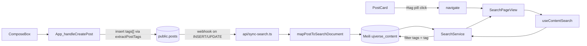

# UJverse — Architect map

Operational memory for subagents working in this repo. **Before changing auth, profiles, follows, RLS, or global UI chrome**, skim the linked sections; prefer extending existing patterns over inventing new ones.

## Table of contents

- [How subagents should use this map](#how-subagents-should-use-this-map)
- [Project overview](#project-overview)
- [Stack](#stack)
- [Workspace layout](#workspace-layout)
- [Routing model](#routing-model)
- [Auth (client)](#auth-client)
- [Profile system](#profile-system)
- [Follow system](#follow-system)
- [Supabase schema from migrations](#supabase-schema-from-migrations)
- [Cohorts / Aula](#cohorts--aula)
- [Auth & RLS model](#auth--rls-model)
- [API surface](#api-surface)
- [Known drift](#known-drift)
- [Glassmorphism, theme, Tailwind v4](#glassmorphism-theme-tailwind-v4)
- [Services & adapters](#services--adapters)
- [Types](#types)
- [Smart Tags & search indexing](#smart-tags--search-indexing)
- [Component dependency hotspots](#component-dependency-hotspots)

---

## How subagents should use this map

1. **Locate** the layer you are changing (routing in [src/App.tsx](src/App.tsx), data in [src/services/DataService.ts](src/services/DataService.ts) / adapters, schema in [supabase/migrations/](supabase/migrations/), styling in [src/index.css](src/index.css) + [src/styles/theme.ts](src/styles/theme.ts)).
2. **Check invariants** in [.cursor/rules/architect.mdc](.cursor/rules/architect.mdc) so you do not break auth/profile/follow assumptions.
3. **Prefer** prop drilling from `App` for session-scoped UI over new global contexts unless the product explicitly requires one.
4. **Schema truth** for checked-in SQL is **migration files on disk**; [supabase_setup.sql](supabase_setup.sql) is a one-shot bootstrap that may differ in policy wording — see [Known drift](#known-drift).

---

## Project overview

UJverse is a Vite + React SPA using Supabase (Auth + Postgres + Realtime + Storage) for a university-themed social feed: posts, comments (threaded), likes, notifications, department-scoped announcements, events UI, and rich profiles with follows. Most application state for the feed lives in [src/App.tsx](src/App.tsx); feature views are composed under [src/components/](src/components/) and [src/pages/](src/pages/).

---

## Stack

| Layer | Technology |
|--------|------------|
| UI | React 19, Framer Motion, Lucide / Heroicons |
| Styling | Tailwind CSS v4 (`@tailwindcss/vite`), custom `@theme` + CSS variables in [src/index.css](src/index.css) |
| Routing | `react-router-dom` — [`BrowserRouter`](src/main.tsx) only; **no** `<Routes>` / `<Route>` in [src/App.tsx](src/App.tsx) |
| Data | `@supabase/supabase-js`; domain facade [src/services/DataService.ts](src/services/DataService.ts) + adapters |
| Hosting / API | Vercel ([vercel.json](vercel.json)); serverless handler [api/scrape-wziks.ts](api/scrape-wziks.ts) |
| Analytics | `@vercel/analytics` in App |

---

## Workspace layout

| Path | Role |
|------|------|
| [src/App.tsx](src/App.tsx) | Session, `myProfile`, feed/post/comment state, navigation helpers, auth guard, main view switcher |
| [src/main.tsx](src/main.tsx) | React root, `BrowserRouter`, `ThemeProvider`, global Toaster, [src/index.css](src/index.css) |
| [src/components/](src/components/) | Feature UI: feed, profile, events, modals, `ui/BaseCard`, auth shell, etc. |
| [src/pages/](src/pages/) | Full-page or route-shaped pages: [Profile.tsx](src/pages/Profile.tsx), [ResetPassword.tsx](src/pages/ResetPassword.tsx) |
| [src/hooks/](src/hooks/) | e.g. [useProfileData.ts](src/hooks/useProfileData.ts), [useProfileSocialData.ts](src/hooks/useProfileSocialData.ts), [useEvents.ts](src/hooks/useEvents.ts), [useContent.ts](src/hooks/useContent.ts) |
| [src/services/](src/services/) | [DataService.ts](src/services/DataService.ts) + [ad/](src/services/adapters/) per content domain (not one file per DB table) |
| [src/types/](src/types/) | [index.ts](src/types/index.ts), [content.ts](src/types/content.ts), [database.ts](src/types/database.ts) |
| [src/lib/](src/lib/) | Utilities: departments, sanitizer, toast, formatters, Leaflet helpers |
| [src/styles/](src/styles/) | [theme.ts](src/styles/theme.ts) tokens, [mobile-theme.ts](src/styles/mobile-theme.ts) (`PROFILE_MOBILE`, nav, search) |
| [src/data/](src/data/) | Static / fallback data (clubs, mock events) — UI should go through DataService when required |
| [api/](api/) | Vercel functions (scraper) |
| [supabase/migrations/](supabase/migrations/) | Versioned SQL; **authoritative** for what the repo records as schema evolution |

---

## Routing model

- **Path + state hybrid** in [src/App.tsx](src/App.tsx): `activeView` and related state (e.g. `activePostId`, `activeProfileHandle`) combine with `location.pathname` into `effectiveActiveView` (see `effectiveActiveView` / `routeProfileHandle` / `routeThreadPostId`).
- **No `<Routes>` in App** — only `useLocation` / `useNavigate`. [`BrowserRouter`](src/main.tsx) wraps the tree.
- **Key path helpers** (same file): `profileHandleFromPath`, `threadPostIdFromPath`, `isResetPasswordPath`.
- **Deep links**: `/profile/:handle` → `userProfile`; `/thread/:postId` → `post`; `/profile` → own profile; `/reset-password` → password reset without session.

---

## Auth (client)

- **Session** — `useState` + `supabase.auth.getSession()` and `onAuthStateChange` in [src/App.tsx](src/App.tsx). `PASSWORD_RECOVERY` redirects to `/reset-password` when needed.
- **Login** — [src/components/auth/Login.tsx](src/components/auth/Login.tsx) uses **synthetic email** `{username}@ujverse.test` for `signInWithPassword` / `signUp`.
- **Auth shell** — [src/Auth.tsx](src/Auth.tsx) is a styled layout wrapping `Login` only.
- **No AuthContext** — session is local to `App`; there is a separate [src/ThemeContext.tsx](src/ThemeContext.tsx) for light/dark.
- **`myProfile`** — loaded in `App`, passed down as props (e.g. `sharedPostProps`, `Header`, `ProfileModal`, compose).

---

## Profile system

**Hook** [src/hooks/useProfileData.ts](src/hooks/useProfileData.ts):

| | |
|--|--|
| **Inputs** | `userId`, optional `initialProfile` |
| **Outputs** | `{ profile, accentColor, loading }` |
| **Columns** | `id, full_name, username, avatar_url, banner_url, bio, department, created_at, role, is_banned` |
| **Realtime** | **None** — single fetch per `userId` / `initialProfile` change |
| **`initialProfile` shortcut** | If `initialProfile?.id === userId`, skips network and sets `loading` false |

---

## Follow system

### SQL — [supabase/migrations/20260411120000_follows.sql](supabase/migrations/20260411120000_follows.sql)

- **Table** `follows`: `(follower_id, following_id)` PK, `created_at`, FK to `profiles`, no self-follow.
- **RLS**: authenticated `SELECT` all rows; `INSERT` / `DELETE` only where `auth.uid() = follower_id`.

### Frontend

- **[src/hooks/useProfileSocialData.ts](src/hooks/useProfileSocialData.ts)** — counts + `isFollowing`, `toggleFollow` with **optimistic UI** and rollback on error; subscribes to **Realtime** on `follows` (`postgres_changes` `*`). Polish error for missing table (`42P01` / schema cache).
- **[src/components/FollowListsModal.tsx](src/components/FollowListsModal.tsx)** — followers/following lists via `follows` + `profiles` joins with FK fallback queries.
- **[src/components/profile/ProfileActionButton.tsx](src/components/profile/ProfileActionButton.tsx)** — follow/edit FAB and inline styles from `PROFILE_MOBILE`.

---

## Supabase schema from migrations

Dense per-file summary (execute order = filename). Tables referenced but **not created** in this folder (e.g. `profiles`, `posts`, `likes`, `comments`, `events`) are assumed from manual / legacy bootstrap ([supabase_setup.sql](supabase_setup.sql)) or remote DDL.

### [20260411120000_follows.sql](supabase/migrations/20260411120000_follows.sql)

- **Table**: `follows` — columns above; indexes on `following_id`, `follower_id`.
- **RLS**: `follows_select_authenticated`, `follows_insert_own`, `follows_delete_own`.
- **Realtime**: not added to `supabase_realtime` in this file.

### [20260411140000_profiles_username.sql](supabase/migrations/20260411140000_profiles_username.sql)

- **DDL**: `profiles.username` column.
- **RPC**: `handle_new_user()` — inserts profile with `username` from `raw_user_meta_data.username` or email local-part; **replaces** prior trigger body.

### [20260412120000_announcements.sql](supabase/migrations/20260412120000_announcements.sql)

- **Table**: `announcements` — `id`, `department`, `lecturer_name`, `body`, `status` (`cancelled` \| `remote` \| `duty`), `created_at`.
- **RLS**: `announcements_select_authenticated` (SELECT, authenticated, `USING (true)`).

### [20260413120000_announcements_realtime_fingerprint.sql](supabase/migrations/20260413120000_announcements_realtime_fingerprint.sql)

- **Columns**: `body_fingerprint` (unique, MD5 of body), backfill + dedupe.
- **Trigger**: `set_announcement_body_fingerprint` on INSERT/UPDATE OF `body`.
- **Realtime**: `REPLICA IDENTITY FULL`; `ALTER PUBLICATION supabase_realtime ADD TABLE announcements`.

### [20260414120000_announcements_source.sql](supabase/migrations/20260414120000_announcements_source.sql)

- **Column**: `announcements.source`.

### [20260415120000_lecturer_names_cache.sql](supabase/migrations/20260415120000_lecturer_names_cache.sql)

- **Table**: `lecturer_names_cache` (`original_name` PK, `nominative_name`, `updated_at`).
- **RLS**: `lecturer_names_cache_select_authenticated`.

### [20260423100000_manual_username_on_signup.sql](supabase/migrations/20260423100000_manual_username_on_signup.sql)

- **RPC**: `handle_new_user()` — **`username` inserted as `null`** (manual profile edit later); **replaces** again.

### [20260501120000_comments_parent_id_recursive.sql](supabase/migrations/20260501120000_comments_parent_id_recursive.sql)

- **Table** `comments` (existing): `parent_id` nullable, self-FK, indexes, `comments_parent_not_self` CHECK.
- **RLS** enabled; policies: `"Publiczne czytanie komentarzy"` SELECT `true`; `"Zalogowani moga dodawac komentarze"` INSERT `auth.uid() = user_id`.

### [20260508184000_replies_engagement_snapshot_rpc.sql](supabase/migrations/20260508184000_replies_engagement_snapshot_rpc.sql)

- **RPC**: `get_replies_engagement_snapshot(p_post_ids, p_reply_ids, p_viewer_id)` — stable; aggregates from `likes`, `comments`, **`comment_likes`**, **`comment_replies`** (see [Known drift](#known-drift)).

### [20260512014500_events_public_select_policy.sql](supabase/migrations/20260512014500_events_public_select_policy.sql)

- **Conditional**: if `public.events` **does not exist**, raises warning and skips.
- **Otherwise**: drops restrictive SELECT policies on `events`, creates `events_select_authenticated_all` (SELECT for `authenticated`, `USING (true)`). File also contains **diagnostic** `SELECT`s for discovery.

### [20260512120000_admin_moderation_rls.sql](supabase/migrations/20260512120000_admin_moderation_rls.sql)

- **RPC**: `is_profile_admin()` — `security definer`, `true` when `profiles.role = 'admin'` for `auth.uid()`.
- **RLS**: `comments_delete_own_or_admin` — DELETE when `user_id = auth.uid()` OR `is_profile_admin()`.

### [20260512135500_events_mutation_rls.sql](supabase/migrations/20260512135500_events_mutation_rls.sql)

- **Conditional** on `public.events`: enables RLS; `events_update_owner_only`, `events_delete_owner_only` (`auth.uid() = user_id`).

### [20260512140000_profiles_public_select.sql](supabase/migrations/20260512140000_profiles_public_select.sql)

- **Conditional** on `public.profiles`: enables RLS; `profiles_select_all` — **SELECT to `authenticated`**, `USING (true)`.

### [20260527120000_posts_tags.sql](supabase/migrations/20260527120000_posts_tags.sql)

- **Column**: `posts.tags text[] NOT NULL DEFAULT '{}'` — denormalized hashtags parsed client-side from `#tag` in `content` (lowercased, deduped).
- **Index**: `posts_tags_gin_idx` (GIN on `tags`) — fast `&&` / `@>` lookups if ever queried in SQL; primary read path is Meilisearch.
- **RLS**: inherits row-level policies of `posts` (no separate policy on the column).

---

## Cohorts / Aula

Module **Aula** = live chat per study-year cohort. **Independent** from `groups` / `group_memberships` (those are smart-tag groups like `#ankiety`; do not conflate).

### SQL — [20260611200000_cohorts_and_aula.sql](supabase/migrations/20260611200000_cohorts_and_aula.sql)

- **`profiles` +columns**: `study_program text`, `year_started int` (CHECK 1990–2100), `study_mode text` (CHECK `stacjonarne|niestacjonarne|doktoranckie`). All nullable → rollout is **opt-in by interaction** (no backfill; nobody joins a cohort until they complete onboarding).
- **`cohorts`**: `id uuid`, `department`, `study_program`, `year_started`, `study_mode`, `name`, `slug UNIQUE`. Business key = unique index on `(study_program, year_started, study_mode)`.
- **`cohort_members`**: PK `(cohort_id, user_id)`, `role` default `member` (`admin`/starosta reserved, unused in MVP).
- **`cohort_messages`**: `id bigserial`, `cohort_id`, `user_id`, `content`, `parent_id` (self-FK, threads), `created_at`, `edited_at`, `deleted_at` (**soft-delete**). `REPLICA IDENTITY FULL`.
- **RPC `ensure_cohort_for_profile(uuid)`** SECURITY DEFINER `SET search_path=public` — upserts cohort + member from profile fields; **no-op** when profile incomplete. Fired by trigger `on_profile_cohort_fields_change` (AFTER INSERT/UPDATE OF study fields on `profiles`).
- **RLS**: `cohorts`/`cohort_members` SELECT = any `authenticated` (`USING true`); no client write policy → inserts only via SECURITY DEFINER RPC (owner bypasses RLS). `cohort_messages` SELECT/INSERT gated by `EXISTS cohort_members(...auth.uid())`; UPDATE/DELETE only own rows.
- **Realtime**: migration `ALTER PUBLICATION supabase_realtime ADD TABLE cohort_messages, cohort_members` (guarded). Unlike `follows`/`likes` (added in Dashboard — see [Known drift](#known-drift)), Aula's publication is **in-migration**.

### SQL — [20260611200500_notifications_reply_aula_type.sql](supabase/migrations/20260611200500_notifications_reply_aula_type.sql)

- Extends `notifications.type` CHECK to include **`reply_aula`**; adds `cohort_message_id bigint` FK.
- Trigger `on_cohort_message_reply` (AFTER INSERT on `cohort_messages`) inserts a `reply_aula` notification to the parent author (skips self-reply). Lives in **migration 2** because it needs the type + column.

### SQL — [20260611201000_cohort_re_cohorting.sql](supabase/migrations/20260611201000_cohort_re_cohorting.sql)

- Re-cohorting: `CREATE OR REPLACE` `handle_profile_cohort_fields_change` to DELETE the old `cohort_members` row when study fields change between two complete profiles. Same trigger, new body — users can have **only one active cohort**.

### SQL — [20260611202000_notifications_mention_aula.sql](supabase/migrations/20260611202000_notifications_mention_aula.sql)

- Extends `notifications.type` CHECK to include **`mention_aula`**.
- Trigger `on_cohort_message_mention` (AFTER INSERT on `cohort_messages`, separate from reply trigger) calls `handle_cohort_message_mention_notifications()`. SECURITY DEFINER, regex `(?:^|\s)@([a-z0-9._-]+)` mirrors client `USERNAME_PATTERN`. Dedup rules: skip self-mentions; skip mentions of users **not in cohort**; skip if `reply_aula` already exists for the same `(user, cohort_message_id)` — `@parentAuthor` never duplicates with reply notification.
- **No** mention notifications on edit (trigger is INSERT-only) — intentional, edits are for typos.

### SQL — [20260611203000_aula_reactions_pin.sql](supabase/migrations/20260611203000_aula_reactions_pin.sql)

- New table **`cohort_message_reactions`** (`id`, `message_id`, **`cohort_id`** denorm via `BEFORE INSERT fill_cohort_reaction_cohort_id` trigger, `user_id`, `emoji`, `created_at`) + `UNIQUE (message_id, user_id, emoji)`. `REPLICA IDENTITY FULL` so DELETE Realtime payload carries the matching row for client diff.
- RLS: SELECT/INSERT members of cohort, DELETE own. Realtime publication added in same migration.
- `cohort_messages` += **`pinned_at TIMESTAMPTZ`** + **`pinned_by UUID`** + partial index `(cohort_id, pinned_at DESC) WHERE pinned_at IS NOT NULL`.
- RPC **`toggle_cohort_message_pin(p_message_id BIGINT)`** SECURITY DEFINER — required because base UPDATE policy is owner-only; RPC enforces membership guard + hard cap **10 pinned/cohort** (raises `pin_limit_reached`). Returns `BOOLEAN` (new state). `GRANT EXECUTE` only to `authenticated`.

### SQL — [20260612090000_aula_files.sql](supabase/migrations/20260612090000_aula_files.sql)

- **Bucket `aula-files`** (private, `file_size_limit = 25 MB`, `allowed_mime_types` = images + PDF + Office + txt/md + zip). First fully-managed Storage bucket in migrations — legacy `media` bucket stays out (public, no RLS).
- **Path convention**: `<cohort_id>/<user_id>/<uuid>-<safe_file_name>` — `storage.foldername(name)[1]` = cohort, `[2]` = uploader. Storage RLS uses both segments; **format is contractual** (don't change).
- **Storage RLS** (3 policies on `storage.objects` scoped to bucket): SELECT for cohort members, INSERT for cohort members **into their own folder**, DELETE only for owner. Files are accessed via signed URLs (default TTL **1h**).
- **Table `cohort_message_attachments`** (`id bigserial`, `message_id` FK CASCADE, **`cohort_id`** denorm via `BEFORE INSERT fill_attachment_cohort_id` trigger, `user_id`, `storage_path`, `file_name`, `mime_type`, `size_bytes`, `width`, `height`, `created_at`). Indexes `(message_id)`, `(cohort_id, created_at DESC)`. `REPLICA IDENTITY FULL` + added to `supabase_realtime` publication (idempotently).
- **Table RLS**: SELECT/INSERT for cohort members (INSERT additionally requires `user_id = auth.uid()` **and** that the uploader is the author of the parent `cohort_messages` row — prevents doctoring cudzych wiadomości). DELETE only for owner.

### SQL — search wiring (no migration)

- **Aula search has no schema delta** — it's pure indexing on top of existing `cohort_messages` + `cohort_message_attachments` (Files drop). Two **Supabase Dashboard → Database → Webhooks** must be added by hand to `https://<deploy>/api/sync-search` (POST, Bearer `SECRET_WEBHOOK_KEY`) on **all events** for both tables. Same endpoint and secret as the `posts`/`announcements`/`profiles` webhooks; routing happens server-side via `payload.table`. Without these webhooks no message will ever land in the `ujverse_aula` index (sync is webhook-driven, not pull).

### SQL — [20260613100000_aula_channels.sql](supabase/migrations/20260613100000_aula_channels.sql)

- **New table `cohort_channels`** (`id bigserial`, `cohort_id` FK CASCADE, `slug` UNIQUE-per-cohort with CHECK `^[a-z0-9][a-z0-9_-]{0,30}$` AND `<> 'general'`, `name` 1–60, `description` ≤280 nullable, `created_by` FK `profiles ON DELETE SET NULL`, `created_at`, `archived_at`). `REPLICA IDENTITY FULL` + added to `supabase_realtime` publication. Index `(cohort_id, archived_at NULLS FIRST, created_at DESC)`. **Note**: `kind` column dodany w [20260613110000_aula_channels_kind.sql](supabase/migrations/20260613110000_aula_channels_kind.sql).
- **`cohort_messages` += `channel_id BIGINT NULL REFERENCES cohort_channels(id) ON DELETE SET NULL`** — `NULL` = virtual `#general` (no row in `cohort_channels`). New index `(cohort_id, channel_id, created_at DESC)`; legacy `(cohort_id, created_at DESC)` kept for pin queries / cohort-wide stats.
- **Trigger `validate_cohort_message_channel`** (BEFORE INSERT OR UPDATE OF `channel_id`) — enforces `channel.cohort_id == message.cohort_id` (data integrity sanity, even though client UI never sends mismatched channel).
- **RLS** — SELECT for cohort members, INSERT for cohort members **AND `created_by = auth.uid()`**, UPDATE for `created_by = auth.uid()` (caller can change name/description/archived_at; cohort_id/slug/created_by changes are soft-guarded by service layer). **NO `DELETE` policy** ⇒ all DELETE from `authenticated` role are rejected — archive is the only "removal" path. Defensive `ON DELETE SET NULL` on `cohort_messages.channel_id` survives a service-role hard delete (messages fall back to virtual #general).
- **Pin RPC update** — `toggle_cohort_message_pin` now caps **10 pins PER CHANNEL** instead of per cohort. `WHERE channel_id IS NOT DISTINCT FROM v_msg.channel_id` makes `NULL` (=Sala główna) its own bucket. Backward-compatible: existing per-cohort pins simply get re-bucketed.

### SQL — [20260613110000_aula_channels_kind.sql](supabase/migrations/20260613110000_aula_channels_kind.sql)

- **`cohort_channels` += `kind text NOT NULL DEFAULT 'inne'`** + CHECK constraint `cohort_channels_kind_check` (`kind IN ('wyk','cw','lab','sem','proj','inne')`). DB trzyma **ASCII** (`cw`, nie `ćw`) — chroni przed niespodziankami collation; display-only mapping `cw → ćw` po stronie klienta w [src/components/aula/ChannelKindPill.tsx](src/components/aula/ChannelKindPill.tsx).
- **Index `(cohort_id, kind) WHERE archived_at IS NULL`** — partial, tani; pod przyszły filter "pokaż tylko sale typu lab".
- **Sala główna (virtual, `channel_id IS NULL`) NIE ma `kind`** — pozostaje czystą instancją bez pilla, UI renderuje `GraduationCap` ikonę zamiast pilla typu. Sub-channels mają zawsze `kind` (default `'inne'` jeśli user nie wybrał).
- **Rebrand UI**: "Kanał" → "Sala" w całym copy (sidebar header "Sale", "Stwórz salę", placeholder "Wiadomość w sali …", empty state "Cisza w sali …", pin error "Maks. 10 przypiętych w tej sali …", archived notice "Ta sala jest zarchiwizowana …"). DB/API/URL params zostają — table `cohort_channels`, `?channel=<slug>`, RLS, pin cap (per-channel), unread tracking, deep-linking, slug system bez zmian.

### Frontend

- **Data**: [src/services/CohortService.ts](src/services/CohortService.ts) (getMyCohorts (sorted `joined_at DESC`)/getMembers/getMessages/**getMessageById**/send/edit/softDelete/subscribeToMessages + **togglePin/getPinnedMessages** (now per-channel via `channelId?: number|null|undefined` param) **/addReaction/removeReaction/getReactionsForCohort/subscribeToReactions** + **createAttachmentRecord/getAttachmentsForCohort/getRecentFiles/signedUrlForPath/signedUrlsForPaths/subscribeToAttachments/deleteAttachment** + **getChannels/createChannel/updateChannel/archiveChannel/unarchiveChannel/subscribeToChannels**) → uses `supabase` directly (adapter-style, parallel to Notifications). Single `MESSAGE_SELECT_FIELDS` covers `pinned_at`/`pinned_by`/**`channel_id`**. `ChannelFilter` convention: `null` = #general, `number` = sub-channel, `undefined` = no filter. Search lives in [src/services/SearchService.ts](src/services/SearchService.ts) — `searchAula(query, { cohortId (mandatory), channelId?, authorId?, hasAttachments?, since?, limit?, offset? })` hits Meili `ujverse_aula` and returns `{ hits: AulaSearchHit[], estimatedTotalHits }`. `channelId === null` translates to Meili filter `(channelId IS NULL OR channelId NOT EXISTS)` so legacy docs without re-indexed `channelId` still match #general.
- **Hooks**: [src/hooks/useMyCohort.ts](src/hooks/useMyCohort.ts) (resolves cohort + `hasMissingProfileFields`), [src/hooks/useCohortMessages.ts](src/hooks/useCohortMessages.ts) (**accepts `channelId?: number | null`** — filters fetch + ignores Realtime events from other channels; optimistic send w/ temp negative id stamps `channel_id`, Realtime debounced `syncLatest` merge-by-id, `buildMessageTree` thread helper; pinned fields propagate through `mergeById`; **`sendMessage(content, parentId?, attachmentInputs?)` flushes `createAttachmentRecord` per file after parent INSERT** — failures toast but never roll back the message), **[src/hooks/useCohortChannels.ts](src/hooks/useCohortChannels.ts)** (fetch + Realtime on `cohort_channels`; exposes `channels`/`archived`/`activeChannelId`/`activeChannel`/`setActiveChannelId`/`setActiveChannelBySlug`/`resolveSlugToChannelId`/`resolveChannelIdToSlug`/`createChannel`/`updateChannel`/`archiveChannel`/`unarchiveChannel`; CRUD ops fire `toast.success` on completion + `toast.error` on failure; reserved `general` slug maps to `activeChannelId = null`; also exports `GENERAL_SLUG`, `isValidChannelSlug`, `deriveSlugFromName`, plus **`readLastChannel(cohortId)`/`writeLastChannel(cohortId, slug)`** persistence helpers keyed on single `localStorage` JSON `ujverse.aula.lastChannelByCohort`; **kind filter state** — `kindFilter: Set<ChannelKind>` + `availableKinds: Set<ChannelKind>` + `toggleKindFilter(kind)` + `clearKindFilter()`, hydratowane z `localStorage` `ujverse.aula.channelKindFilter` per cohort + helpery `readKindFilter(cohortId)`/`writeKindFilter(cohortId, kinds)`), [src/hooks/useAulaUnread.ts](src/hooks/useAulaUnread.ts) (localStorage `lastSeenAulaAt` + Realtime INSERT subscription, skipped while user is on `/aula` — **stays cohort-wide** for nav badge), **[src/hooks/useChannelUnread.ts](src/hooks/useChannelUnread.ts)** (per-channel session-scoped unread set — no initial fetch, Realtime INSERT on `cohort_messages` filter `cohort_id=eq.<id>` bumps `Set<number|null>` when `created_at > lastSeen[channelKey]`; auto-marks `activeChannelId` as seen via effect; storage key `ujverse.aula.channelLastSeen.<cohortId>` → JSON `{ "general": iso, "<channelId>": iso }`; `ChannelRail` reads `unreadChannels` prop and renders a small accent dot per item), [src/hooks/useCohortReactions.ts](src/hooks/useCohortReactions.ts) (`Map<messageId, ReactionAggregate[]>` with `mine` flag, Realtime INSERT/DELETE merge, optimistic `toggleReaction` with rollback), [src/hooks/useAulaPresence.ts](src/hooks/useAulaPresence.ts) (Supabase Realtime **Presence** channel `aula-online-<cohortId>`, `presence.key=user_id` ⇒ multi-tab dedup, ephemeral Set, `untrack` on cleanup), **[src/hooks/useCohortAttachments.ts](src/hooks/useCohortAttachments.ts)** (`Map<messageId, CohortMessageAttachment[]>` initial fetch via `getAttachmentsForCohort` + Realtime INSERT/DELETE merge; **signed-URL cache** keyed by `storage_path` with `expiresAt`; periodic 60 s tick re-signs entries with <5 min left via batched `signedUrlsForPaths`).
- **UI**: [src/components/aula/](src/components/aula/) — `AulaView` (lazy, **3-column desktop**: `ChannelRail w-56` | chat (flex-1) | cohort meta + members aside `w-60 xl:flex`; **mobile**: dual swipowane drawery — left `ChannelsSheet` toggled by `#name` button, right `MembersSheet` toggled by `Users` button; integrates `useCohortChannels` + `useCohortMessages({ channelId: activeChannelId })` + `useChannelUnread` (rail dots); URL sync `?channel=<slug>` ↔ `activeChannelId` (replace, not push) + deep-link `?message=<id>` priority: `getMessageById` → resolve `channel_id` → `setActiveChannelId` → existing scroll/highlight effect; `clearMessageParam` preserves `?channel=` slug; `setActiveChannelAndUrl` also `writeLastChannel(cohortId, slug)` + bumpuje `focusBump` (composer focus on user-click only — initial / URL sync / deep-link NIE bumpują); **reset effect na `activeChannelId`** zeruje `didInitialScrollRef`/`lastMessageIdRef`/`loadOlderAttemptsRef`/`deepLinkHandledForRef` + `setPinned([])`/`setShowNewBadge(false)`/`setReplyTarget(null)` — bez tego scroll-to-bottom dziala tylko raz per mount; smart auto-scroll, skeleton + **3 warianty empty state** (#general samotny vs #general pusty rocznik vs sub-channel "Cisza w #foo"), **PinnedMessagesStrip per-channel** (cap 10 raises `pin_limit_reached` → toast "Maks. 10 przypiętych w tym kanale"), online count badge, "Pliki rocznika" + "Szukaj w Auli" buttons), `AulaMessageItem` (recursive, max depth 2, **Markdown** via `react-markdown`+`remark-gfm` with whitelist + `mention://` schema → `<button>` navigates `/u/<username>`, **ReactionBar + hover EmojiReactionPicker + pin/unpin button + Pin badge + presence dot on avatar + `<MessageAttachments />` below body**), `AulaComposer` (Ctrl+Enter + `@` autocomplete dropdown sourced from cohort `members` + **paperclip + drag-drop overlay + `AttachmentChip` row**; **placeholder `Wiadomość w #${channelName}`, `disabled` + `archivedNotice` banner gdy `activeChannel.archived_at != null`**; uploads run in parallel before `onSend`, chips mark `error` per-file on failure; cap 10 attachments/message; **`focusKey` prop** — change → `textareaRef.focus({ preventScroll: true })`, initial mount no-op), `AulaOnboardingModal` (3-step wizard → UPDATE `profiles` → trigger auto-join), **`EmojiReactionPicker`** (curated 8 emoji, click-outside + Esc), **`ReactionBar`** (pigułki [emoji count] with `mine` highlight + tooltip names), **`PinnedMessagesStrip`** (collapsible header, jump-to-message via existing `?message=<id>` deep-link), **`MessageAttachments`** (image grid with `aspect-ratio` from DB `width/height` for CLS-safe layout + file cards with `Download` link; skeleton while signed URL is missing; hover trash for owner), **`RecentFilesPanel`** (createPortal: bottom-sheet on mobile / right-side drawer on desktop; filter chips Wszystkie/Obrazki/Dokumenty/Inne; grouped by date Dziś/Wczoraj/W tym tygodniu/Wcześniej; lazy fetch on open — `getRecentFiles(50)` + `signedUrlsForPaths`), **`AulaSearchModal`** (createPortal: bottom-sheet mobile / center-modal desktop; debounced 200 ms `SearchService.searchAula`; **opcjonalny "Tylko w sali" toggle gdy `activeChannelId` jest konkretnym sub-kanałem** + **rząd interaktywnych kind pigułek** (multi-select OR) z mutex na toggle "Tylko w sali" (pigułki dim się gdy konkretny kanał aktywny — `kindFilterDisabled`); `selectedKindsKey` w dep array żeby Set referential equality nie blokował re-search; result rows pokazują `ChannelKindPill` + nazwa sali; klik → `onJump(messageId)` → scroll+highlight via existing `?message=<id>` deep-link), **`ChannelRail`** (lewy pasek: virtual "Sala główna" na górze z ikoną `GraduationCap` + active sale (sorted by `created_at DESC` z hooka) z `<ChannelKindPill kind={channel.kind} />` zamiast `#` + "Archiwum" accordion collapsed na dole + "+ Stwórz salę" CTA; każdy item klika `setActiveChannelAndUrl`; **`unreadChannels?: ReadonlySet<number|null>` prop** → mała kropka + bold name dla itemów z nowymi wiadomościami, suppressed gdy item aktywny; **`kindFilter` / `availableKinds` / `onToggleKind` / `onClearKindFilter` props** → rząd interaktywnych `ChannelKindPill` nad listą gdy `availableKinds.size >= 2`, filter aplikowany lokalnie `useMemo` do active + archived, empty state z "Wyczyść filter" CTA gdy 0 sal pasuje; Sala główna zawsze widoczna ponad filtrem), **`ChannelHeader`** (nad chatem: `<ChannelKindPill kind={channel.kind} size="md" />` + `name` + opcjonalny `Archiwum` badge + opis; Sala główna ma `GraduationCap` zamiast pilla i statyczny tekst "Sala główna"; gear dropdown widoczny tylko dla `created_by === currentUserId` → Edytuj name/typ/opis (otwiera `CreateChannelModal mode='edit'`) / Archiwizuj / Przywróć; brak Delete CTA — RLS deny), **`CreateChannelModal`** (modal 4-fieldowy: name → auto-derive slug w locie (override-able), **typ** (radio group 6 pigułek wyk/ćw/lab/sem/proj/inne; default `inne`), slug, description optional; regex + reserved `general` + uniqueness check; tryb `'edit'` prefill (włącznie z `kind`) + slug locked; submit przez hook → toast on slug-unique / kind-check violation), **`ChannelKindPill`** ([src/components/aula/ChannelKindPill.tsx](src/components/aula/ChannelKindPill.tsx) — single source of truth wyglądu pilla typu; eksportuje `CHANNEL_KINDS` (literal tuple), `CHANNEL_KIND_META` (mapa `kind → {label, long, tint, text}`), helpery `kindLabel(kind)` / `kindLongName(kind)`; reużywany w Rail/Header/Modal/AulaView mobile header/search badges).
- **Shared**: [src/lib/aulaMentions.ts](src/lib/aulaMentions.ts) — `MENTION_REGEX`, `extractMentions`, `findMentionTrigger` (composer + renderer share one regex, mirror of SQL trigger). **[src/lib/aulaUpload.ts](src/lib/aulaUpload.ts)** — `MAX_FILE_SIZE` (25 MB), `ALLOWED_MIME_TYPES`/`ACCEPT_ATTR` (mirror of `storage.buckets` whitelist), `validateFile`, `sanitizeFileName`, `buildAttachmentPath`, `getImageDimensions`, `uploadAulaFile`, plus `getFileIcon`/`formatFileSize`/`isImageMime` helpers. **First centralised Storage helper in repo** — legacy `media` uploads stay inline.
- **Routing**: `/aula` → `parseAppRoute` view `'aula'`; full-width `main` (like `chat`); `ChatAssistantFab` hidden on Aula. Entry points: Header desktop pill + Header user-dropdown item (mobile) + `MobileDashboard` rail tile (all with unread dot from `useAulaUnread`). **Not** in `BottomNav` (kept at 5). **Global search wiring**: `App.tsx` calls `useMyCohort` and passes `cohortId` + `navigateToAulaMessage` to both `Header` (→ `OmniSearchHub`, new `AulaSection` after `EventsSection`) and `SearchPageView` (new `aula` tab + `AulaResultsSection`). Clicking any Aula hit (global or local) ultimately deep-links to `/aula?message=<id>`.
- **Notifications**: `reply_aula` + `mention_aula` rendered in [NotificationItem](src/components/notifications/NotificationItem.tsx) + [NotificationsView](src/components/NotificationsView.tsx) (icons `GraduationCap` / `AtSign`); click → `navigate('/aula?message=<id>')` (highlight handled locally in `AulaView`). Reactions and pins **don't** notify (intentional, avoids bell spam).

### Invariants

- Onboarding/Settings write **only** `profiles` study fields; cohort membership is **always** derived by the trigger/RPC — never insert into `cohorts`/`cohort_members` from the client.
- Changing study fields **removes** the old `cohort_members` row (re-cohorting). MVP assumes one active cohort per user; `getMyCohorts` returns `joined_at DESC` so the latest wins.
- Deletions are **soft** (`deleted_at` + emptied `content`); never hard-delete messages from UI.
- `@mention` parser (client + SQL) MUST stay in sync; if you change `USERNAME_PATTERN`, update both `aulaMentions.ts` and `handle_cohort_message_mention_notifications`.
- Mention notifications only insert for users **in the cohort** — bridge users / outsiders cannot be cross-cohort-mentioned (Phase 2).
- **Pin** goes through `toggle_cohort_message_pin` RPC (SECURITY DEFINER) — never UPDATE `pinned_at`/`pinned_by` directly from client (current UPDATE policy is owner-only). Pinned-strip de-pins of soft-deleted messages are passive: `getPinnedMessages` filters `deleted_at IS NULL` (the row still has `pinned_at` set, just hidden).
- **Reactions** `cohort_id` denorm column is filled by `fill_cohort_reaction_cohort_id` BEFORE INSERT trigger — clients send only `message_id`+`emoji`+`user_id`. Don't bypass the trigger or Realtime filter (`cohort_id=eq.<id>`) breaks.
- **Presence** is ephemeral (Supabase Realtime Presence, in-memory). No "last seen" persistence. Scaling caveat: in-memory state per subscriber works for cohort sizes ~30–200; bigger cohorts will need a different model (Phase 2).
- **Aula attachments** **always** go through [`lib/aulaUpload.ts`](src/lib/aulaUpload.ts) (`uploadAulaFile`) — never call `supabase.storage.from('aula-files').upload` inline. `cohort_message_attachments.cohort_id` is filled by `fill_attachment_cohort_id` BEFORE INSERT trigger (clients send `message_id`+metadata+`storage_path`+`user_id`). Don't bypass the trigger or table RLS / Realtime filter (`cohort_id=eq.<id>`) breaks.
- **Storage path format** `<cohort_id>/<user_id>/<uuid>-<safe_file_name>` is contractual — Storage RLS (`storage.foldername(name)[1..2]`) depends on it. If you change the format, update all three storage policies in lockstep.
- **Signed URLs** default to **TTL 1 h**; `useCohortAttachments` re-signs entries with <5 min remaining via a 60-second `setInterval`. Don't cache raw URLs anywhere else — always go through `getSignedUrl(path)` from the hook.
- **Orphan files**: soft-deleting a `cohort_messages` row **does not** purge its attachments — the `ON DELETE CASCADE` only fires on hard delete (which Aula never does for messages). Rows stay in `cohort_message_attachments` and objects stay in the bucket; `AulaMessageItem` simply doesn't render them when `deleted_at IS NOT NULL`. MVP accepts the bucket bloat — Phase 2 needs a cron/Storage-lifecycle cleanup. Single-attachment deletes via `CohortService.deleteAttachment` do remove both DB row **and** Storage object (best-effort `storage.remove`), so they don't leave orphans.
- **Search isolation**: `SearchService.searchAula` **always** requires a non-empty `cohortId`; the filter `cohortId = "<id>"` is **the only** mechanism keeping a user from reading another year's messages (Meili public search-key has no RLS analog). Always sourced from `useMyCohort` (trusted path); never from URL/user input. Empty `cohortId` returns a no-op result, never fires a request.
- **Soft-delete = DELETE from `ujverse_aula`** (not a content-blank). `mapCohortMessageToSearchDocument` returns `null` when `deleted_at IS NOT NULL`, the webhook converts that into `DELETE document`. Hard-delete (`cohort_messages` row removal) also hits the same path.
- **Attachment changes re-index parent message**: any `INSERT/UPDATE/DELETE` on `cohort_message_attachments` fires the webhook; the handler refetches the parent `cohort_messages` row + remaining attachments and re-upserts the full `AulaSyncDocument`. This keeps `fileNames` / `hasAttachments` in sync — without it search by filename gets stale after deletes.
- **Snippet sanitization**: any `_formatted` field from Meili that goes through `dangerouslySetInnerHTML` must pass through `sanitizeSnippetHtml` in [src/lib/normalizeSearchHits.ts](src/lib/normalizeSearchHits.ts) — it escapes every tag and only re-allows `<mark>`. Don't render `_formatted` raw, even for "trusted" content (Markdown body may contain literal HTML).
- **NULL `channel_id` = virtual #general** — there is **no** row in `cohort_channels` for #general. All legacy pre-channel messages are #general automatically. The slug `'general'` is reserved (CHECK constraint blocks creation); URL `?channel=general` deterministically maps to `activeChannelId = null` via `resolveSlugToChannelId`. Never try to "materialise" #general as a real channel row.
- **`cohort_channels` DELETE is RLS-deny for `authenticated`** — there is no DELETE policy. The only "removal" path is `archived_at = NOW()` (UPDATE, creator-only). Defensive `ON DELETE SET NULL` on `cohort_messages.channel_id` survives a hard delete by service-role / db owner (messages fall back to virtual #general). UI must never expose a hard-delete CTA.
- **Channel-cohort match** is enforced by trigger `validate_cohort_message_channel` — message `channel_id` must point to a channel with matching `cohort_id`. Client UI never sends mismatched values, but the trigger is the contractual guarantee (sanity for service-role inserts / future bulk imports).
- **Pin cap = 10 PER CHANNEL** (was per cohort in MVP). `toggle_cohort_message_pin` counts with `channel_id IS NOT DISTINCT FROM v_msg.channel_id` so #general has its own bucket distinct from each sub-channel. UI `getPinnedMessages(cohortId, channelId)` must always pass `activeChannelId` (`null` for #general).
- **`searchAula({ channelId })` is optional** — omitted = whole cohort, `null` = #general only (`channelId IS NULL OR NOT EXISTS`), `number` = that channel. UI surfaces this via the "Tylko w #channel" toggle inside `AulaSearchModal`. Global `OmniSearchHub` / `SearchPageView → AulaResultsSection` deliberately don't pass `channelId` (cohort-wide search).
- **Last active channel per cohort** persists in single `localStorage` JSON key `ujverse.aula.lastChannelByCohort` → `{ [cohortId]: slug }`. Resolver priority for initial channel after mount: `?message=<id>` (deep-link, resolves via `getMessageById.channel_id`) → `?channel=<slug>` (URL) → `readLastChannel(cohortId)` (only when `slug !== 'general'`) → `#general` (`activeChannelId = null`). Fallback fires **once per cohort** (guarded by `initialSlugAppliedRef`) so user choosing #general explicitly isn't bounced back to last sub-channel by re-render.
- **Channel switch resets per-channel state** in `AulaView`: a `useEffect` on `[activeChannelId]` clears `didInitialScrollRef`/`lastMessageIdRef`/`loadOlderAttemptsRef`/`deepLinkHandledForRef` refs and `setPinned([])`/`setShowNewBadge(false)`/`setReplyTarget(null)`. Without this reset, `didInitialScrollRef = true` from first mount prevents auto-scroll-to-bottom on switch (user lands at the top of the new channel), `lastMessageIdRef` carries an id from the old channel (false "new message" detection), and stale pins flash until the per-channel refetch returns. When adding any new "first message arrived" guard or scroll/highlight ref to `AulaView`, **it MUST be reset in this effect** or per-channel UX silently regresses.
- **`cohort_channels.kind` ma 6-wartościowy enum (`wyk`/`cw`/`lab`/`sem`/`proj`/`inne`), DB trzyma ASCII**. UI mapuje `cw → ćw` przez `CHANNEL_KIND_META.label` w [ChannelKindPill](src/components/aula/ChannelKindPill.tsx). Zmiana listy = update CHECK constraint w [migracji 20260613110000](supabase/migrations/20260613110000_aula_channels_kind.sql) **ORAZ** `CHANNEL_KINDS` + `CHANNEL_KIND_META` w lockstep — TypeScript wymusi resztę. Default w DB: `'inne'`; hook/serwis powiela default (defensywnie) — backfill istniejących wierszy NIE jest robiony, dostają `'inne'` z DEFAULT.
- **Sala główna (virtual #general) NIE ma `kind`** — to nadal wirtualny kanał bez rekordu w `cohort_channels` (`channel_id IS NULL`). UI renderuje specjalny header / ikonę `GraduationCap` / label "Sala główna" — NIE pill typu. W search hits `channelId == null` → fallback do `Sala główna` z `GraduationCap`, NIE do "general" string. Wirtualność = jedyna sala bez creatora, bez edytowalności i bez archiwizacji.
- **Kind filter w `useCohortChannels`** — hook exposuje `kindFilter: Set<ChannelKind>`, `availableKinds: Set<ChannelKind>` (memo z `channels`), `toggleKindFilter(kind)` + `clearKindFilter()`. Hydratacja z `localStorage` przy zmianie cohortu (klucz `ujverse.aula.channelKindFilter` → JSON `{ [cohortId]: ChannelKind[] }`, sortowany). **`channels`/`archived` z hooka pozostają nietknięte** — filter aplikuje `ChannelRail` lokalnie (`useMemo`), żeby mention autocomplete / deep-linking / search modal widziały komplet. Pigułki w `ChannelRail` renderują się tylko gdy `availableKinds.size >= 2` (chronimy przed bezsensownym UI dla świeżych roczników). Sala główna zawsze widoczna na górze niezależnie od filtra (nie ma `kind`). `ChannelsSheet` (mobile drawer) dostaje te same propsy.
- **`searchAula({ channelKinds })` jest MUTEX z `channelId`** — gdy `channelId` jest `number` lub `null` (Sala główna), `channelKinds` ignorujemy w `SearchService.searchAula` (jeden konkretny kanał i tak ma jednoznaczny `kind`, a Sala główna nie ma `channelKind` w Meili). `AulaSearchModal` enforce'uje to wizualnie: gdy toggle "Tylko w tej sali" jest zaznaczony, rząd kind-pigułek dostaje `pointer-events-none opacity-40`. `AulaResultsSection` (cohort-wide `/search?tab=aula`) NIE ma `channelId`, więc kind filter jest tam zawsze dostępny obok `Tylko z plikami` / `Tylko ja`. `filterKey` w obu miejscach musi zawierać sorted-join kindów, inaczej dep array nie odpali ponownej query.
- **`ChannelKindPill` ma 2 tryby** — static (legacy, bez `onClick`) renderuje `` z pełnym tintem; interactive (z `onClick`) renderuje `<button>` z `aria-pressed`, `active === true` = pełny tint, `active === false` = outline-only (`ring-current/30`) + `opacity-60`. NIE używamy dynamicznego `hover:${meta.tint}` (Tailwind v4 by nie wykrył klas z interpolacji) — interactive hover idzie przez `opacity` + neutralny `hover:bg-black/[0.04]`. Filter pigułki w `ChannelRail` / `AulaSearchModal` / `AulaResultsSection` używają tego trybu.
- **Channel mutes są server-side enforced** — tabela `cohort_channel_mutes (user_id, cohort_id, channel_id NULL=Sala główna, mode IN ('all','mentions_only','none'), muted_until)` z RLS per-user (`user_id = auth.uid()`). Dwa partial unique indexy (na `channel_id IS NOT NULL` i `channel_id IS NULL`) zastępują niedziałającego PK z NULL. **Brak rekordu = mode='all' (default)** — RPC `set_channel_mute(cohort, channel, mode, snooze_hours?)` usuwa rekord gdy `mode='all'`, upsertuje przez delete+insert (ON CONFLICT nie działa przez NULL semantics w partial unique indexach). Triggery `handle_cohort_message_reply_notification` i `handle_cohort_message_mention_notifications` sprawdzają mute przed INSERT do `notifications`: `mode='none'` blokuje wszystko, `mode='mentions_only'` przepuszcza tylko mention (reply blokuje); aktywność mute liczy się gdy `muted_until IS NULL OR muted_until > now()` (snooze automatycznie wygasa, bez cron joba). **`channel_id IS NOT DISTINCT FROM NEW.channel_id`** dopasowuje Salę główną (NULL=NULL) tak samo jak konkretny kanał.
- **`useCohortChannelMutes` jest UI-only mirror** — fetch + Realtime + optimistic `setMute` z rollback. **Snooze GC tick co 60s** usuwa z lokalnej mapy wpisy z wygasłym `muted_until` (UI od razu odzwierciedla powrót do default bez page reload). Hook zwraca `getMuteMode(channelId)`, `getMutedUntil(channelId)`, `isMuted(channelId)`, `setMute(channelId, mode, snoozeHours?)`. Konsumenci: `ChannelHeader` (Bell/BellMinus/BellOff button + `ChannelMuteMenu` dropdown z mode + snooze 1h/8h/24h/forever), `ChannelRail` / `ChannelsSheet` (`getMuteMode` prop → mała ikona BellMinus/BellOff obok nazwy + `opacity-70` na wyciszonych itemach). `useChannelUnread` / `useAulaUnread` NIE konsumują mutes (unread = "są nowe wiadomości" niezależnie od preferencji notifikacji — mute dotyczy tylko PUSH do `notifications` tabeli). To celowe — wyciszona sala dalej pokazuje że są nowe wiadomości, po prostu nie krzyczy dzwoneczkiem.
- **Reply vs mention dedup ZACHOWANE pod mute** — istniejący guard "nie wstawiaj mention_aula jeśli reply_aula już istnieje dla tej pary `(user, cohort_message_id)`" działa nadal; dodatkowy `NOT EXISTS` na `cohort_channel_mutes m WHERE m.mode='none'` jest doklejony do tego samego SELECT (kompozycja AND, więc oba guard'y muszą przejść). Reply trigger jest PL/pgSQL (musi sprawdzić mute parent_author po wczesnym return na `parent_id IS NULL` / self-reply), mention trigger jest jednym INSERT...SELECT z guardami — żaden nie pętli per-user, więc cost mute check = stały lookup na partial unique indexie.
- **Typing indicators są EPHEMERAL (Realtime BROADCAST, NIE database)** — [src/hooks/useChannelTyping.ts](src/hooks/useChannelTyping.ts) subskrybuje broadcast channel `aula-typing-<cohortId>-<channelKey>` (per kanał, NIE per cohort — cross-channel typing = noise). Sender broadcastuje event `typing` z `{ userId, name, ts }` z `notifyTyping()` (throttle 3s w hooku — bezpiecznie wołać per keystroke). Receiver dodaje do `Map<userId, { name, expiresAt }>` z TTL 5s, 1s tick interval czyści wygasłe wpisy. **Self-filter na dwóch warstwach**: `config.broadcast.self = false` (Supabase skipuje echo do sendera) + defensive `if raw.userId === currentUserId` (chroni multi-tab tego samego usera). Zero migracji SQL, zero RLS — broadcast jest open dla subskrybenta cohortu (channel name zawiera cohortId, nie ma sposobu na cross-cohort sniffing bez znania ID). `useChannelTyping` reset-uje lokalną mapę przy każdej zmianie `cohortId | channelId | currentUserId` (re-subskrypcja).
- **`AulaComposer.onTyping` jest opcjonalne** — composer woła `onTyping?.()` z `handleChange` gdy `next.length > 0` (clear-po-submit nie triggeruje eventu, nie spamujemy presence po wysłaniu). Hook samodzielnie throttluje, więc composer NIE musi tego robić. `ChannelHeader` zamienia description na "X pisze..." gdy `typingUsers.length > 0` (1 linia → 1 linia, brak skoku layoutu); format: `Janek pisze` / `Janek i Anna piszą` / `Janek i N innych pisze`. Animacja `--animate-typing-dot` (1.2s ease-in-out infinite, 0/150/300ms stagger) zdefiniowana w `src/index.css` (Tailwind v4 `@theme`).
- **Polls są 1:1 z `cohort_messages` (single-select MVP)** — tabela `cohort_message_polls (id, message_id UNIQUE, cohort_id, user_id, question, options JSONB array, closed_at, created_at)` + `cohort_poll_votes (poll_id, user_id, cohort_id, option_index, PRIMARY KEY (poll_id, user_id))`. UNIQUE `message_id` enforce'uje 1:1; PRIMARY KEY na votes enforce'uje single-select. Constrainty DB: question 1–240 chars, options to JSONB array długości 2–10, `option_index BETWEEN 0 AND 9`. RLS SELECT dla cohort_member, INSERT polla tylko dla autora message'a (`cohort_messages.user_id = auth.uid()`), INSERT vote tylko gdy poll otwarty (`closed_at IS NULL`) i głosujący w cohorcie, UPDATE polla tylko by creator (na `closed_at`), **DENY DELETE polla** (znika tylko z `ON DELETE CASCADE` od soft-deleted message). RPC `vote_on_poll(p_poll_id, p_option_index)` jest atomowe (DELETE existing + INSERT new w jednej transakcji); `p_option_index = -1` cofa głos (sam DELETE); RPC RAISE gdy poll zamknięty / option out-of-range. RPC `close_poll(p_poll_id)` — tylko creator.
- **`useCohortPolls` jest cohort-scoped (nie per-channel)** — fetch wszystkich polli + votes dla cohortu, Realtime na 4 kanałach (poll INSERT/UPDATE + vote INSERT/DELETE) przez jeden `aula-polls-<cohortId>` channel. Aggregate `CohortPollAggregate { poll, countsPerOption, votersPerOption, totalVotes, myVoteIndex }` budowany w hooku; `pollIdToMessageIdRef` to indeks żeby Realtime na votes (które nie znają messageId) mogło szybko znaleźć aggregate. **Optimistic vote**: `applyVoteToAggregate` lokalnie mutuje counts/voters/myVoteIndex (single-select invariant: najpierw usuń stary głos usera z dowolnej opcji, potem dodaj nowy), RPC `vote_on_poll` potwierdza; rollback ze snapshotu na error. Realtime jest idempotent z optimistic update (applyVoteToAggregate sprawdza `includes(userId)` przed dodaniem).
- **`AulaComposer` poll button = tryb 1-modal-1-poll** — button BarChart3 otwiera `PollCreator`, po `onConfirm` payload `{ question, options }` ląduje w local `poll` state; chip pod attachments pokazuje preview + [Edytuj] / [×]. `onSend` rozszerzony o 3-ci arg `poll?: ComposerPollInput`; `canSend` true gdy `(content || attachments || poll)` — można wysłać samą ankietę (pusty content + sam poll). `useCohortMessages.sendMessage(content, parentId, attachments, pollInput)`: po INSERT message → `createPollRecord` (failure NIE rollbackuje messageu, tylko toast — UX simpler niż dwufazowy commit). Optimistic message NIE renderuje pollu od razu — Realtime na `cohort_message_polls` go dosypie sekundę później (acceptable lag, drop nie blokuje hot path).
- **`PollDisplay` UX**: bars z animowanym `width: ${percent}%` (framer-motion spring), opacity 50% gdy `!hasVoted && !isClosed` (zachęta do głosowania zanim zobaczysz results), top-option highlight (emerald) tylko po zamknięciu pollu (`isClosed`). Voters: pierwsze 3 nazwiska z `userNames` map (już istniejąca z reactions) + `+N` overflow. Self-vote pokazuje pełny checkmark + `cofnij głos` link. Closed pill (`Lock` icon) + tooltip z datą; creator widzi `Zamknij ankietę` button gdy `isOwner && !isClosed`.
- **Channel notes są last-write-wins z `version BIGINT` (NIE CRDT)** — tabela `cohort_channel_notes (cohort_id, channel_id NULL=Sala główna, content TEXT, version, last_edited_by, last_edited_at)` z dwoma partial unique indexami (channel_id NOT NULL / IS NULL) — ten sam wzorzec co `cohort_channel_mutes` (NULL w PK nie działa). RLS: **tylko SELECT dla cohort_member** — wszystkie writes idą przez RPC `update_channel_note` (`SECURITY DEFINER`), który sam sprawdza member + version + channel-w-cohort. RPC RAISE `'conflict:<current_version>'` gdy `p_expected_version != current_version`; klient (`CohortService.updateChannelNote`) parsuje `conflictVersion` z `error.message` żeby uniknąć drugiego round-trip. **Content cap = 100 KB** (CHECK constraint + RPC validation), defensywnie przed flood. Brak CRDT (Yjs / Automerge) — świadomy trade-off: simple > collaborative; konflikty rozwiązuje user (banner "Pobierz cudze" / "Zachowaj moje").
- **`useChannelNote` rozróżnia `server` od `draft`** — server = ostatnio wiedziona wersja z bazy (po fetch / save / Realtime), draft = lokalny stan textarea. **Autosave debounced 1.5s** po stop typing, manual `saveNow()` (`Ctrl+S`), oba wołają RPC z `expected_version = serverVersion`. Realtime na `cohort_channel_notes` filtruje per channel; **3 paths obsługujące updates od innych**: (1) my-echo (ignoruj: `row.version <= cur.version && row.last_edited_by === currentUserId`), (2) no-local-edits (bezboleśnie podstaw fresh: `draft === cur.content`), (3) local-edits-present (zablokuj autosave, status `'remote-update'`, banner — user wybiera `acceptRemote` / `overrideWithMine`). Conflict status (po RPC RAISE) = analogicznie zablokuj + fetch fresh + banner. `blockedRef` to per-edit flag żeby nie spamować save'ami w trakcie conflictu.
- **`ChannelNotePanel` / `ChannelNoteSheet` toggle z `ChannelHeader`** — przycisk `StickyNote` (między bell i gear) ustawia `notesOpen` w `AulaView`. Desktop (`xl:flex`): panel-aside po prawej stronie chat section (`w-80 border-l`), zastępuje members aside na bardzo szerokich widokach (`xl:contents`). Mobile/tablet: `<ChannelNoteSheet>` jako bottom sheet (analogicznie do `MembersSheet` / `ChannelsSheet`, `max-h-[85vh]`, drag-to-close ≥80px). Re-mount przy zmianie `(cohortId, channelId)` w `useChannelNote` flushuje pending autosave przed re-fetch. Markdown preview tab używa `react-markdown + remarkGfm` (re-use z `MessageBody`); edit textarea jest plain text z monospace font.
- **Zadania (deadlines) per sala** — `cohort_channel_tasks (id, cohort_id, channel_id NULL=Sala główna, created_by, title 1–200, description ≤2000, due_at NULL, priority CHECK low/normal/high, completed_at NULL, completed_by NULL)` + `cohort_task_completions (task_id, user_id, cohort_id, completed_at, PRIMARY KEY (task_id, user_id))`. PK na completions = idempotent per-user "ja zrobiłem" invariant; toggle przez RPC `toggle_my_task_completion(p_task_id)` (atomowy DELETE-or-INSERT z RETURNING, returns `boolean` = nowy state). Globalne "deal done" (Notion-style shared closing) przez RPC `toggle_global_task_done(p_task_id)` — każdy w cohorcie może zamknąć/otworzyć (UPDATE `completed_at` + `completed_by`). RLS: SELECT cohort_member, INSERT cohort_member (`created_by = auth.uid()` + channel-w-cohort check), UPDATE cohort_member (kolumn-level nie ma, klient nie wysyła zmian poza `completed_at` przez RPC), DELETE tylko twórca. Completions RLS: SELECT cohort_member (transparent "8 zrobiło — w tym Anna, Janek"), INSERT/DELETE tylko własne. Trigger `fill_task_completion_cohort_id` analogicznie do attachments. Realtime na obu tabelach.
- **`useChannelTasks` smart sort** — open tasks first (po `due_at` ASC, NULLS LAST → tiebreak po priority high→normal→low → tiebreak po `created_at` DESC), potem completed (po `completed_at` DESC). Aggregate `CohortTaskAggregate { task, completionsCount, completionUserIds, myCompletedAt }`. **Optimistic mutations**: `toggleMyCompletion` (apply/remove completion), `toggleGlobalDone` (set/unset `task.completed_at` lokalnie), `deleteTask` (remove z mapy, rollback ze snapshotu na error), `createTask` (NIE optimistic — czekamy na Realtime INSERT żeby dostać prawdziwy ID bez fakeID rekoncyliacji).
- **`ChannelTasksPanel` / `ChannelTasksSheet`** = drugi panel po prawej (mutually exclusive z `ChannelNotePanel` — `AulaView` enforce'uje przez `if (!notesOpen) setTasksOpen(false)` w toggle handlerach). Przycisk `CheckSquare` w `ChannelHeader` przed `StickyNote`. `TaskItem` ma checkbox "ja zrobiłem" (per-user, left), priority pill (`TaskPriorityPill` z `TASK_PRIORITY_META`), due badge (`formatDueBadge`: "Za 5 min" / "Za 3h" / "Za 2 dni" / "5 lis 2026" / "Spóźnione 1d" — tone-color: rose/amber/sky/emerald-done/zinc-far) i collapsible expanded view (description + completionUserIds awatary + "Zamknij dla wszystkich" button). Delete icon (`Trash2`) widoczna tylko hover gdy `created_by === currentUserId`. Sortowanie pre-computed w hooku, panel po prostu mapuje.
- **Tasks filter tabs + counts** — `ChannelTasksPanel` renderuje pasek z 5 filtrami (`Wszystkie`/`Dziś`/`Spóźnione`/`Otwarte`/`Zamknięte`) między header a listą; ukrywany gdy `counts.all === 0`. Liczniki obliczamy raz przez `useMemo` (O(N), single pass), tab `Spóźnione` ma czerwone tło gdy count > 0. Empty state per-filter dostaje przycisk „Pokaż wszystkie" żeby user się nie zaciął.
- **Powiadomienia o nowych zadaniach** — migracja [20260620100000_aula_task_notifications.sql](supabase/migrations/20260620100000_aula_task_notifications.sql) dodaje kolumnę `notifications.task_id` (FK na `cohort_channel_tasks` z `ON DELETE CASCADE`), rozszerza CHECK `notifications_type_allowed` o `'aula_task_new'` i instaluje trigger `handle_task_new_notifications` (AFTER INSERT na `cohort_channel_tasks`) — fan-out per cohort_member, skip creator + skip `cohort_channel_mutes.mode='none'`. Klient: `AppNotification.type` rozszerzone o `'aula_task_new'`, dodano `task_id` + embed `task { id, title, due_at, channel_id, cohort_id }` w `NotificationsAdapter`. `NotificationsView` renderuje `CheckSquare` jako badge ikonę oraz tekst "dodał(a) zadanie: {title}". Deep-link: navigate `/aula?task=<id>`; `AulaView` parsuje `taskIdFromUrl`, fetch przez `CohortService.getTaskById`, switch channel + open tasks panel + clear `?task` z URL (idempotent przez `taskDeepLinkHandledForRef`).
- **`useCohortChannelTaskCounts` + ChannelRail badge** — hook subscribuje jeden Realtime channel `aula-task-counts-<cohortId>` na zmiany w `cohort_channel_tasks` filtered po `cohort_id`, każdy event wymusza full refetch przez `CohortService.getOpenTaskCountsForCohort` (jedno SELECT + client-side agregacja po `channel_id`, NULL = Sala główna). Wynik to `Map<number | null, number>` przekazywana do `ChannelRail` jako `openTaskCounts`. `TaskBadge` (mała amber pigułka z `CheckSquare` + liczbą, cap "99+") renderuje się obok mute icon/unread dot — pomijana gdy `count === 0`. Re-renders są tanie (jedna Map, hooki referencyjnie stabilne).
- **Voice notes (głosówki) per wiadomość** — migracja [20260623100000_aula_voice_notes.sql](supabase/migrations/20260623100000_aula_voice_notes.sql) dodaje kolumnę `cohort_message_attachments.duration_seconds INTEGER NULL` (+ soft CHECK ≤3600s) i rozszerza bucket `aula-files` `allowed_mime_types` o `audio/webm`, `audio/mp4`, `audio/ogg`, `audio/mpeg`. Klient: `useVoiceRecorder` hook wokół MediaRecorder (state-machine `idle/requesting/recording/denied/error`, RMS volume z AnalyserNode dla wizualizacji, twardy cleanup tracks+AudioContext per unmount). UI hard-cap 5 min (`MAX_VOICE_DURATION_S=300`) + 10 MB (`MAX_VOICE_SIZE_BYTES`), min 1s żeby uniknąć micro-tapów. Composer ma osobny mic button (czerwony w trybie recording), w trybie nagrywania renderuje `VoiceRecorderInline` (timer `m:ss / 5:00`, pseudo-waveform bars sterowane RMS volume, Wyślij/Anuluj). Po confirm: blob → syntetyczny `File` (`voice-<ISO>.<ext>`) → `uploadAulaFile` z `durationSeconds` → `createAttachmentRecord` z `duration_seconds`. ACCEPT_ATTR `<input type="file">` filtruje `audio/*` — głosówki idą TYLKO przez mic flow.
- **`VoiceMessagePlayer` + `MessageAttachments` grouping** — `MessageAttachments` partycjonuje załączniki na 3 grupy: `images` (grid CLS-safe z `width/height`), `audios` (full-width voice player), `files` (klasyczne karty z download). `VoiceMessagePlayer` to natywny `<audio preload="metadata">` z customowym UI (round play button + scrubable progress bar + `m:ss / m:ss` w tabular-nums). Duration source: pierwsza wartość z `attachment.duration_seconds` (server-side trust), fallback do `audio.duration` z `loadedmetadata` (na wypadek legacy recordów bez ms).

---

## Auth & RLS model

- **`handle_new_user` evolution**: [20260411140000_profiles_username.sql](supabase/migrations/20260411140000_profiles_username.sql) (username from metadata/email) → [20260423100000_manual_username_on_signup.sql](supabase/migrations/20260423100000_manual_username_on_signup.sql) (username **`null`**). Trigger attachment lives in [supabase_setup.sql](supabase_setup.sql) (`on_auth_user_created`), not in migrations.
- **`is_profile_admin()`**: [20260512120000_admin_moderation_rls.sql](supabase/migrations/20260512120000_admin_moderation_rls.sql); uses **`profiles.role`**.
- **Profiles SELECT**: migration [20260512140000_profiles_public_select.sql](supabase/migrations/20260512140000_profiles_public_select.sql) restricts policy to **`authenticated`** (not anonymous). Legacy [supabase_setup.sql](supabase_setup.sql) used `using (true)` without role — **drift** if both were applied differently.

---

## API surface

- **[api/scrape-wziks.ts](api/scrape-wziks.ts)** — Vercel Node handler (`export default`); scrapes ISI announcements, Groq optional for nominative names, upserts `announcements` + `lecturer_names_cache` with service-role Supabase client. Requires env vars (e.g. `GROQ_API_KEY`, Supabase URL + **service** key — see file).
- **[api/sync-search.ts](api/sync-search.ts)** — Vercel Node handler called by Supabase webhook on `posts` / `announcements` / `profiles` / **`cohort_messages` / `cohort_message_attachments`** INSERT/UPDATE/DELETE; uses [lib/searchSyncMapper.ts](lib/searchSyncMapper.ts) to map row → document and pushes to Meilisearch. Lazily ensures index settings via [lib/meilisearchIndexSettings.ts](lib/meilisearchIndexSettings.ts) (`ensureContentIndexSettings`, `ensureUsersIndexSettings`, **`ensureAulaIndexSettings`**) before first upsert. Aula attachments don't get their own document — the handler refetches the parent `cohort_messages` row and re-indexes it. Edge-function duplicate in [supabase/functions/_shared/searchMapper.ts](supabase/functions/_shared/searchMapper.ts) (see [Known drift](#known-drift)).
- **[vercel.json](vercel.json)** — currently **`{ "version": 2 }`** only. Function routing/rewrites are **defaults** (API routes under `/api` map to `api/`). Document env secrets in deployment, not in repo.

---

## Known drift

- **`comment_likes`**, **`comment_replies`**, **`notifications`**, **`posts`**, **`events`**, **`media` storage**: used in app and/or RPC but **not created** in [supabase/migrations/](supabase/migrations/) (partial coverage in [supabase_setup.sql](supabase_setup.sql)). NB: the **`media`** bucket is still drift (public, no RLS) — only the **`aula-files`** bucket is fully managed in a migration ([20260612090000_aula_files.sql](supabase/migrations/20260612090000_aula_files.sql)).
- **`get_replies_engagement_snapshot`** references **`comment_likes`** / **`comment_replies`** — add migrations or remove RPC if tables are absent.
- **`profiles.role` / `is_banned`** — used in [src/App.tsx](src/App.tsx) and types; **`is_banned` not in migration folder** (may exist only in live DB).
- **[src/supabaseClient.ts](src/supabaseClient.ts)** — **hardcoded** project URL and anon key (rotate in Supabase if leaked; prefer env for new work).
- **Policy naming**: [supabase_setup.sql](supabase_setup.sql) also defines `profiles_select_all` but with **different role scope** than [20260512140000_profiles_public_select.sql](supabase/migrations/20260512140000_profiles_public_select.sql) — reconcile in DB.
- **Realtime**: only **`announcements`** added to publication in migrations; **`follows`**, **`likes`**, **`comments`**, **`comment_likes`**, **`notifications`** subscriptions in code may require matching **Supabase Dashboard → Realtime** settings.
- **Search mapper duplication**: [lib/searchSyncMapper.ts](lib/searchSyncMapper.ts) (Node webhook) and [supabase/functions/_shared/searchMapper.ts](supabase/functions/_shared/searchMapper.ts) (Deno Edge function) hold **parallel** `mapPostToSearchDocument` **and** `mapCohortMessageToSearchDocument` implementations. Schema changes affecting indexed fields (e.g. tags, `fileNames`) must be applied to **both** files; the Edge variant's `SearchContentDocument` is also slimmer (no `announcementStatus`/`announcementSource`) but its `AulaSyncDocument` matches the Node one.
- **`authorName` in old Aula documents goes stale** when a user changes their `profiles.full_name` — same as `ujverse_content` (`SearchContentDocument.author`). We re-index on message UPDATE / attachment change, not on profile changes (out of scope; Phase 2 = bulk re-index trigger from `profiles` AFTER UPDATE).
- **Channel rename/archive/kind-change doesn't re-index existing messages** — `channelName` / `channelSlug` / **`channelKind`** w `ujverse_aula` documents są snapshotami z czasu message-upsertu. Renaming / kind-change kanału przez `updateChannel` NIE kaskaduje do indeksu — search hits pokażą starą wartość pilla aż user napisze nową wiadomość w sali (która re-indexuje). To samo z archiwizacją (badge i tak żyje, `channelId` zostaje OK do filtrowania). Phase 2 = trigger na `cohort_channels AFTER UPDATE` z bulk re-index affected messages. Current workaround: any edit/new message in the channel refreshes that single document.
- **Existing messages need a re-index after migrations `20260613100000` / `20260613110000`** — old `cohort_messages` rows have `channel_id IS NULL` (i ich `ujverse_aula` documents predate field `channelId` / `channelKind`). UI gracefully treats missing `channelId` as Sala główna (filter uses `channelId IS NULL OR channelId NOT EXISTS`), legacy `channelKind` brakuje → klient pillem fallback do `'inne'` (przez `CHANNEL_KINDS.includes` guard w `asChannelKind`). Hot path stays correct; only a forced re-index (touch every row, e.g. `UPDATE cohort_messages SET content = content`) would backfill `channelId: null` + `channelKind: null` everywhere. Acceptable for MVP — Sala główna i tak nie ma `kind` (NULL), więc backfill głównie pomoże sub-channelom z legacy.
- **Meili filterable attributes on remote**: [lib/meilisearchIndexSettings.ts](lib/meilisearchIndexSettings.ts) sets them lazily from [api/sync-search.ts](api/sync-search.ts) on first cold start. Existing remote indexes provisioned before this code shipped need either a cold restart with traffic, or a one-off `scripts/resync-search-final.ts` run, to gain `tags` in `filterableAttributes`.

---

## Glassmorphism, theme, Tailwind v4

- **Global CSS** [src/index.css](src/index.css): `@import "tailwindcss"`, `@custom-variant dark`, dense **`@theme { ... }`** block mapping design tokens, `@layer base` CSS variables for light/dark (glass borders, gold accents).
- **Theme toggle** [src/ThemeContext.tsx](src/ThemeContext.tsx) — toggles `document.documentElement` class `dark`, persists `uj-theme`, optional View Transitions API.
- **Cards** — [src/components/ui/BaseCard.tsx](src/components/ui/BaseCard.tsx) uses [src/styles/theme.ts](src/styles/theme.ts) (`theme.colors.surface.glass` = `backdrop-blur-md`, layered borders/shadows).
- **Profile mobile glass** — [src/styles/mobile-theme.ts](src/styles/mobile-theme.ts) `PROFILE_MOBILE.card.glassClass` (and related `glassLight` / `glassDark`) for profile shell blur/saturation.

---

## Services & adapters

- **[src/services/DataService.ts](src/services/DataService.ts)** — Facade: clubs, announcements (+ realtime subscribe), unified posts mapping, events adapter, **no raw `App` imports**.
- **Adapters** — [AnnouncementsAdapter.ts](src/services/adapters/AnnouncementsAdapter.ts), [PostsAdapter.ts](src/services/adapters/PostsAdapter.ts), [EventsAdapter.ts](src/services/adapters/EventsAdapter.ts), [ClubsAdapter.ts](src/services/adapters/ClubsAdapter.ts); common patterns in [BaseAdapter.ts](src/services/adapters/BaseAdapter.ts).
  - **[PostsAdapter.toUnified](src/services/adapters/PostsAdapter.ts)** — type-guarded mapping of `raw.tags` into `metadata.tags` (`filter((tag): tag is string => typeof tag === 'string' && tag.length > 0)`); no lowercase here — DB layer already normalises.
- **[src/services/SearchService.ts](src/services/SearchService.ts)** — Meilisearch facade (`searchUnified` / `searchContent` / `searchUsers` / `searchProfiles`). `UnifiedSearchOpts.tag?: string` triggers content-only filter `tags = "${escapedTag}"` and forces `includeUsers: false`. Falls back to [parseTagSearchQuery](src/lib/postTags.ts) on raw `q` when `opts.tag` not provided.
- **[src/services/EventIngestor.ts](src/services/EventIngestor.ts)** — separate ingestion path for events data.

---

## Types

- **[src/types/index.ts](src/types/index.ts)** — `Profile`, `Post` (with `tags?: string[] | null`), `Comment`, `AppNotification` (legacy domain types).
- **[src/types/content.ts](src/types/content.ts)** — unified content model for feed/widgets (`UnifiedContent`, meta per kind); `PostMeta.tags: string[]` is the Smart Tags surface for UI.
- **[src/types/search.ts](src/types/search.ts)** — `SearchHit` / `SearchUserHit` shape exchanged with Meilisearch (`SearchHit.tags?: string[]`); normaliser in [src/lib/normalizeSearchHits.ts](src/lib/normalizeSearchHits.ts).
- **[src/types/database.ts](src/types/database.ts)** — generated or hand-maintained DB typings (align with actual Supabase).

---

## Smart Tags & search indexing

End-to-end flow for `#hashtag` extraction, indexing, and `#tag` filtered search.

### Data layer

- **Schema** — [supabase/migrations/20260527120000_posts_tags.sql](supabase/migrations/20260527120000_posts_tags.sql): `posts.tags text[] NOT NULL DEFAULT '{}'`, GIN index `posts_tags_gin_idx`. Tags inherit row-level policies of `posts`.
- **Extraction** — [src/lib/postTags.ts](src/lib/postTags.ts) `extractPostTags(text)` regex `/#([a-zA-Z0-9_]+)/g` → lowercase, deduped. Used in `App.handleCreatePost` insert payload and as fallback in resync scripts.
- **Normalisation helper** — same file: `normalizePostTags(unknown)` for defensive read (type-guard `(t): t is string => typeof t === 'string'` → `trim` → `toLowerCase` → `filter(Boolean)` → `new Set`).
- **Hashtags stay in `content`** — `#ankieta` remains visible in body; `tags[]` is a denormalisation for filtering only.

### Search indexing

- **Mapper** — [lib/searchSyncMapper.ts](lib/searchSyncMapper.ts) `mapPostToSearchDocument` writes `tags: record.tags.filter(typeof === 'string').map(trim().toLowerCase()).filter(Boolean)` into `SearchContentDocument`. Skips banned authors and empty content.
- **Edge duplicate** — [supabase/functions/_shared/searchMapper.ts](supabase/functions/_shared/searchMapper.ts) carries the **same** logic; keep in sync (see [Known drift](#known-drift)).
- **Index settings** — [lib/meilisearchIndexSettings.ts](lib/meilisearchIndexSettings.ts) `CONTENT_FILTERABLE_ATTRIBUTES = ['type', 'department', 'tags', 'announcementStatus']`. `ensureContentIndexSettings(client, indexUid?)` creates the index lazily (`primaryKey: 'id'`) and pushes filterable attrs. **Required** before any `tags = "..."` filter — Meili otherwise responds with `attribute not filterable`.
- **Webhook** — [api/sync-search.ts](api/sync-search.ts) calls `ensureContentIndexSettings` once per cold start before upserting.

### Aula search index (`ujverse_aula`)

- **Separate Meili index** from `ujverse_content` because per-cohort isolation requires `cohortId` in `filterableAttributes`, and Aula content semantically isn't part of the public posts/announcements feed. Sharing the index would either leak filters or force every public query to add `NOT cohortId EXISTS`.
- **Settings** — [lib/meilisearchIndexSettings.ts](lib/meilisearchIndexSettings.ts) `ensureAulaIndexSettings`: `searchable=['content','authorName','fileNames']`, **`filterable=['cohortId','channelId','channelKind','authorId','hasAttachments','createdAtTs']`**, `sortable=['createdAtTs']`, `rankingRules=[default..., 'createdAtTs:desc']` (recency tie-break). `channelKind` doadny pod przyszły filter "tylko sale typu lab" — nie używany przez `SearchService.searchAula` (UI), settings są lazy via `ensureAulaIndexSettings`.
- **Document** — `AulaSyncDocument` in [lib/searchSyncMapper.ts](lib/searchSyncMapper.ts) + mirror in [supabase/functions/_shared/searchMapper.ts](supabase/functions/_shared/searchMapper.ts): primary key `aula-msg-<message_id>`. Includes **`channelId`/`channelSlug`/`channelName`/`channelKind`** (all `null` dla Sali głównej — wirtualna sala bez rekordu). Author resolved via service-role profile fetch, `fileNames`/`hasAttachments` denormed from `cohort_message_attachments` so search-by-filename works. Channel metadata fetched in parallel with author + attachments via `fetchChannelById` (SELECT `id, slug, name, kind`) only when `record.channel_id IS NOT NULL`. **Soft-deleted messages return `null` from the mapper** → webhook converts to `DELETE`.
- **Webhook setup** — `cohort_messages` + `cohort_message_attachments` need to be added as **Supabase Dashboard → Database → Webhooks** to the same `/api/sync-search` endpoint as posts/announcements (no migration for this; same Bearer secret). Without these, `ujverse_aula` stays empty. **Note**: `cohort_channels` changes (rename/archive) do **not** re-index existing messages — `channelName` / `channelSlug` in `ujverse_aula` may go stale until those messages get re-upserted (see [Known drift](#known-drift)).
- **Query path** — `SearchService.searchAula` is the only entry point; mandatory `cohortId` (sourced from `useMyCohort`, never URL); optional `channelId` (`null` for #general, `number` for sub-channel) and optional `channelKinds: ChannelKind[]` (MUTEX with `channelId` — kind filter only applies cohort-wide). `attributesToHighlight=['content','fileNames']`, `cropLength=30`, snippets sanitized via `sanitizeSnippetHtml` in [src/lib/normalizeSearchHits.ts](src/lib/normalizeSearchHits.ts) (strip-all-tags-except-`<mark>`). Three consumers: `OmniSearchHub` `AulaSection` (desktop md+ palette — shows pill+name badge per hit, no kind filter UI to keep palette fast), `SearchPageView` `aula` tab + `AulaResultsSection` (`/search?tab=aula`, paginated, with `hasAttachments` / `onlyMe` / **kind-pills** filters, pill+name badge per hit), and `AulaSearchModal` (local search inside Aula, optional "Tylko w sali" toggle + **kind-pills** (mutex disabled when toggle on), badge per hit, jumps via existing `?message=<id>` deep-link).

### Resync scripts (operational)

- **[scripts/resync-search-final.ts](scripts/resync-search-final.ts)** — self-contained re-sync (no `lib/` / `src/` imports, inlined mapper + `extractPostTags`). Idempotent upsert to `ujverse_content` keyed by `id`. Falls back to extracting tags from `content` when `posts.tags` is empty so old rows still gain searchable tags without a DB backfill. Reads `SUPABASE_URL` / `SUPABASE_SERVICE_KEY` with fallbacks to `VITE_SUPABASE_URL` / `SUPABASE_SERVICE_ROLE_KEY`. Run: `npx tsx scripts/resync-search-final.ts`.
- **[scripts/force-resync.ts](scripts/force-resync.ts)** — destructive variant: `deleteAllDocuments()` on `ujverse_content` and `ujverse_users`, then full rebuild for posts + announcements + profiles. Same DB-tags-or-extract fallback for posts. Use only when index is corrupted.
- **[scripts/backfill-tags.ts](scripts/backfill-tags.ts)** — backfill the `posts.tags` **column** itself by re-parsing `content` for rows where `tags = '{}'`. Run before the resync scripts if you want the column populated in Postgres too.

### Search query path

- **Parser** — [src/lib/postTags.ts](src/lib/postTags.ts) `parseTagSearchQuery(q)` → `{ tag, textQuery }`. Matches exact `^#[a-zA-Z0-9_]+$`; mixed queries (`ankieta #foo`) fall through as plain text.
- **Hooks** — [src/hooks/useContentSearch.ts](src/hooks/useContentSearch.ts) (search page) and [src/hooks/useOmniSearch.ts](src/hooks/useOmniSearch.ts) (Ctrl+K) both feed `tag: parsed.tag ?? undefined` into `SearchService.searchUnified`. When `tag` is present they force `includeUsers: false`.
- **Service** — [src/services/SearchService.ts](src/services/SearchService.ts) `UnifiedSearchOpts.tag?: string` → emits Meili filter `tags = "${escapedTag}"` on `ujverse_content`; empties `q` when no `textQuery` accompanies the tag.
- **UI** — [src/components/PostCard.tsx](src/components/PostCard.tsx) renders tags as `<button>` pills (`border-brand-gold/30`, hover variant) that call `useNavigate()(\`/search?q=%23${encodeURIComponent(tag)}\`)` directly — no callback prop. [src/components/SearchPageView.tsx](src/components/SearchPageView.tsx) parses URL `?q=` via `parseTagSearchQuery`, shows a "Filtr tagu: #..." chip, auto-selects the `Posty` filter, and seeds the input with the raw query (hash preserved).

### Invariants when editing

1. **Keep three normalisation paths in sync** — `extractPostTags` (insert), `mapPostToSearchDocument` (Meili), `normalizePostTags`/adapter filter (UI read). Diverging cases (e.g. allowed character classes) will silently lose tags.
2. **Never query Meili filter without `ensureContentIndexSettings`** for a fresh index.
3. **Edge mapper duplicate** — when changing tags logic in [lib/searchSyncMapper.ts](lib/searchSyncMapper.ts), mirror it into [supabase/functions/_shared/searchMapper.ts](supabase/functions/_shared/searchMapper.ts).
4. **No `any` in tag pipelines** — use `(t): t is string => typeof t === 'string'` type-guards.

---

## Component dependency hotspots

| Component | Role |
|-----------|------|
| [BaseCard](src/components/ui/BaseCard.tsx) | All card shells; token-driven variants (`default` / `inner` / `premium`). |
| [UserAvatar](src/components/UserAvatar.tsx) | Shared avatar discipline across feed, profile, modals. |
| [PostCard](src/components/PostCard.tsx) | Post layout + interaction bar contract with App-owned state; **owns** tag-pill navigation via `useNavigate` (no `onTagClick` prop). |
| [FeedView](src/components/FeedView.tsx) | Feed composition, compose, department filter. |
| [SearchPageView](src/components/SearchPageView.tsx) | `/search` view; parses `?q=` (text or `#tag`), drives `useContentSearch`, renders filter chips + full `PostCard` for post hits. |
| [Profile page](src/pages/Profile.tsx) | Profile orchestration; uses `useProfileData`, `useProfileSocialData`, `FollowListsModal`. |
| [Header](src/components/Header.tsx) / [BottomNav](src/components/BottomNav.tsx) | Global navigation; `myProfile` / view callbacks. |
| [ComposeBox](src/components/ComposeBox.tsx) | Create post; storage upload path from App. |
| [CommentThread](src/components/CommentThread.tsx) / [CommentItem](src/components/CommentItem.tsx) | Threaded comments + likes. |

---

*Last validated against migration files and sources in repo root `C:\Users\frani\ujverse`.*
