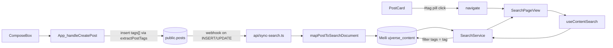

# UJverse — Architect map

Operational memory for subagents working in this repo. **Before changing auth, profiles, follows, RLS, or global UI chrome**, skim the linked sections; prefer extending existing patterns over inventing new ones.

## Table of contents

- [How subagents should use this map](#how-subagents-should-use-this-map)
- [Project overview](#project-overview)
- [Stack](#stack)
- [Workspace layout](#workspace-layout)
- [Routing model](#routing-model)
- [Auth (client)](#auth-client)
- [Profile system](#profile-system)
- [Follow system](#follow-system)
- [Supabase schema from migrations](#supabase-schema-from-migrations)
- [Auth & RLS model](#auth--rls-model)
- [API surface](#api-surface)
- [Known drift](#known-drift)
- [Glassmorphism, theme, Tailwind v4](#glassmorphism-theme-tailwind-v4)
- [Services & adapters](#services--adapters)
- [Types](#types)
- [Smart Tags & search indexing](#smart-tags--search-indexing)
- [Component dependency hotspots](#component-dependency-hotspots)

---

## How subagents should use this map

1. **Locate** the layer you are changing (routing in [src/App.tsx](src/App.tsx), data in [src/services/DataService.ts](src/services/DataService.ts) / adapters, schema in [supabase/migrations/](supabase/migrations/), styling in [src/index.css](src/index.css) + [src/styles/theme.ts](src/styles/theme.ts)).
2. **Check invariants** in [.cursor/rules/architect.mdc](.cursor/rules/architect.mdc) so you do not break auth/profile/follow assumptions.
3. **Prefer** prop drilling from `App` for session-scoped UI over new global contexts unless the product explicitly requires one.
4. **Schema truth** for checked-in SQL is **migration files on disk**; [supabase_setup.sql](supabase_setup.sql) is a one-shot bootstrap that may differ in policy wording — see [Known drift](#known-drift).

---

## Project overview

UJverse is a Vite + React SPA using Supabase (Auth + Postgres + Realtime + Storage) for a university-themed social feed: posts, comments (threaded), likes, notifications, department-scoped announcements, events UI, and rich profiles with follows. Most application state for the feed lives in [src/App.tsx](src/App.tsx); feature views are composed under [src/components/](src/components/) and [src/pages/](src/pages/).

---

## Stack

| Layer | Technology |
|--------|------------|
| UI | React 19, Framer Motion, Lucide / Heroicons |
| Styling | Tailwind CSS v4 (`@tailwindcss/vite`), custom `@theme` + CSS variables in [src/index.css](src/index.css) |
| Routing | `react-router-dom` — [`BrowserRouter`](src/main.tsx) only; **no** `<Routes>` / `<Route>` in [src/App.tsx](src/App.tsx) |
| Data | `@supabase/supabase-js`; domain facade [src/services/DataService.ts](src/services/DataService.ts) + adapters |
| Hosting / API | Vercel ([vercel.json](vercel.json)); serverless handler [api/scrape-wziks.ts](api/scrape-wziks.ts) |
| Analytics | `@vercel/analytics` in App |

---

## Workspace layout

| Path | Role |
|------|------|
| [src/App.tsx](src/App.tsx) | Session, `myProfile`, feed/post/comment state, navigation helpers, auth guard, main view switcher |
| [src/main.tsx](src/main.tsx) | React root, `BrowserRouter`, `ThemeProvider`, global Toaster, [src/index.css](src/index.css) |
| [src/components/](src/components/) | Feature UI: feed, profile, events, modals, `ui/BaseCard`, auth shell, etc. |
| [src/pages/](src/pages/) | Full-page or route-shaped pages: [Profile.tsx](src/pages/Profile.tsx), [ResetPassword.tsx](src/pages/ResetPassword.tsx) |
| [src/hooks/](src/hooks/) | e.g. [useProfileData.ts](src/hooks/useProfileData.ts), [useProfileSocialData.ts](src/hooks/useProfileSocialData.ts), [useEvents.ts](src/hooks/useEvents.ts), [useContent.ts](src/hooks/useContent.ts) |
| [src/services/](src/services/) | [DataService.ts](src/services/DataService.ts) + [ad/](src/services/adapters/) per content domain (not one file per DB table) |
| [src/types/](src/types/) | [index.ts](src/types/index.ts), [content.ts](src/types/content.ts), [database.ts](src/types/database.ts) |
| [src/lib/](src/lib/) | Utilities: departments, sanitizer, toast, formatters, Leaflet helpers |
| [src/styles/](src/styles/) | [theme.ts](src/styles/theme.ts) tokens, [mobile-theme.ts](src/styles/mobile-theme.ts) (`PROFILE_MOBILE`, nav, search) |
| [src/data/](src/data/) | Static / fallback data (clubs, mock events) — UI should go through DataService when required |
| [api/](api/) | Vercel functions (scraper) |
| [supabase/migrations/](supabase/migrations/) | Versioned SQL; **authoritative** for what the repo records as schema evolution |

---

## Routing model

- **Path + state hybrid** in [src/App.tsx](src/App.tsx): `activeView` and related state (e.g. `activePostId`, `activeProfileHandle`) combine with `location.pathname` into `effectiveActiveView` (see `effectiveActiveView` / `routeProfileHandle` / `routeThreadPostId`).
- **No `<Routes>` in App** — only `useLocation` / `useNavigate`. [`BrowserRouter`](src/main.tsx) wraps the tree.
- **Key path helpers** (same file): `profileHandleFromPath`, `threadPostIdFromPath`, `isResetPasswordPath`.
- **Deep links**: `/profile/:handle` → `userProfile`; `/thread/:postId` → `post`; `/profile` → own profile; `/reset-password` → password reset without session.

---

## Auth (client)

- **Session** — `useState` + `supabase.auth.getSession()` and `onAuthStateChange` in [src/App.tsx](src/App.tsx). `PASSWORD_RECOVERY` redirects to `/reset-password` when needed.
- **Login** — [src/components/auth/Login.tsx](src/components/auth/Login.tsx) uses **synthetic email** `{username}@ujverse.test` for `signInWithPassword` / `signUp`.
- **Auth shell** — [src/Auth.tsx](src/Auth.tsx) is a styled layout wrapping `Login` only.
- **No AuthContext** — session is local to `App`; there is a separate [src/ThemeContext.tsx](src/ThemeContext.tsx) for light/dark.
- **`myProfile`** — loaded in `App`, passed down as props (e.g. `sharedPostProps`, `Header`, `ProfileModal`, compose).

---

## Profile system

**Hook** [src/hooks/useProfileData.ts](src/hooks/useProfileData.ts):

| | |
|--|--|
| **Inputs** | `userId`, optional `initialProfile` |
| **Outputs** | `{ profile, accentColor, loading }` |
| **Columns** | `id, full_name, username, avatar_url, banner_url, bio, department, created_at, role, is_banned` |
| **Realtime** | **None** — single fetch per `userId` / `initialProfile` change |
| **`initialProfile` shortcut** | If `initialProfile?.id === userId`, skips network and sets `loading` false |

---

## Follow system

### SQL — [supabase/migrations/20260411120000_follows.sql](supabase/migrations/20260411120000_follows.sql)

- **Table** `follows`: `(follower_id, following_id)` PK, `created_at`, FK to `profiles`, no self-follow.
- **RLS**: authenticated `SELECT` all rows; `INSERT` / `DELETE` only where `auth.uid() = follower_id`.

### Frontend

- **[src/hooks/useProfileSocialData.ts](src/hooks/useProfileSocialData.ts)** — counts + `isFollowing`, `toggleFollow` with **optimistic UI** and rollback on error; subscribes to **Realtime** on `follows` (`postgres_changes` `*`). Polish error for missing table (`42P01` / schema cache).
- **[src/components/FollowListsModal.tsx](src/components/FollowListsModal.tsx)** — followers/following lists via `follows` + `profiles` joins with FK fallback queries.
- **[src/components/profile/ProfileActionButton.tsx](src/components/profile/ProfileActionButton.tsx)** — follow/edit FAB and inline styles from `PROFILE_MOBILE`.

---

## Supabase schema from migrations

Dense per-file summary (execute order = filename). Tables referenced but **not created** in this folder (e.g. `profiles`, `posts`, `likes`, `comments`, `events`) are assumed from manual / legacy bootstrap ([supabase_setup.sql](supabase_setup.sql)) or remote DDL.

### [20260411120000_follows.sql](supabase/migrations/20260411120000_follows.sql)

- **Table**: `follows` — columns above; indexes on `following_id`, `follower_id`.
- **RLS**: `follows_select_authenticated`, `follows_insert_own`, `follows_delete_own`.
- **Realtime**: not added to `supabase_realtime` in this file.

### [20260411140000_profiles_username.sql](supabase/migrations/20260411140000_profiles_username.sql)

- **DDL**: `profiles.username` column.
- **RPC**: `handle_new_user()` — inserts profile with `username` from `raw_user_meta_data.username` or email local-part; **replaces** prior trigger body.

### [20260412120000_announcements.sql](supabase/migrations/20260412120000_announcements.sql)

- **Table**: `announcements` — `id`, `department`, `lecturer_name`, `body`, `status` (`cancelled` \| `remote` \| `duty`), `created_at`.
- **RLS**: `announcements_select_authenticated` (SELECT, authenticated, `USING (true)`).

### [20260413120000_announcements_realtime_fingerprint.sql](supabase/migrations/20260413120000_announcements_realtime_fingerprint.sql)

- **Columns**: `body_fingerprint` (unique, MD5 of body), backfill + dedupe.
- **Trigger**: `set_announcement_body_fingerprint` on INSERT/UPDATE OF `body`.
- **Realtime**: `REPLICA IDENTITY FULL`; `ALTER PUBLICATION supabase_realtime ADD TABLE announcements`.

### [20260414120000_announcements_source.sql](supabase/migrations/20260414120000_announcements_source.sql)

- **Column**: `announcements.source`.

### [20260415120000_lecturer_names_cache.sql](supabase/migrations/20260415120000_lecturer_names_cache.sql)

- **Table**: `lecturer_names_cache` (`original_name` PK, `nominative_name`, `updated_at`).
- **RLS**: `lecturer_names_cache_select_authenticated`.

### [20260423100000_manual_username_on_signup.sql](supabase/migrations/20260423100000_manual_username_on_signup.sql)

- **RPC**: `handle_new_user()` — **`username` inserted as `null`** (manual profile edit later); **replaces** again.

### [20260501120000_comments_parent_id_recursive.sql](supabase/migrations/20260501120000_comments_parent_id_recursive.sql)

- **Table** `comments` (existing): `parent_id` nullable, self-FK, indexes, `comments_parent_not_self` CHECK.
- **RLS** enabled; policies: `"Publiczne czytanie komentarzy"` SELECT `true`; `"Zalogowani moga dodawac komentarze"` INSERT `auth.uid() = user_id`.

### [20260508184000_replies_engagement_snapshot_rpc.sql](supabase/migrations/20260508184000_replies_engagement_snapshot_rpc.sql)

- **RPC**: `get_replies_engagement_snapshot(p_post_ids, p_reply_ids, p_viewer_id)` — stable; aggregates from `likes`, `comments`, **`comment_likes`**, **`comment_replies`** (see [Known drift](#known-drift)).

### [20260512014500_events_public_select_policy.sql](supabase/migrations/20260512014500_events_public_select_policy.sql)

- **Conditional**: if `public.events` **does not exist**, raises warning and skips.
- **Otherwise**: drops restrictive SELECT policies on `events`, creates `events_select_authenticated_all` (SELECT for `authenticated`, `USING (true)`). File also contains **diagnostic** `SELECT`s for discovery.

### [20260512120000_admin_moderation_rls.sql](supabase/migrations/20260512120000_admin_moderation_rls.sql)

- **RPC**: `is_profile_admin()` — `security definer`, `true` when `profiles.role = 'admin'` for `auth.uid()`.
- **RLS**: `comments_delete_own_or_admin` — DELETE when `user_id = auth.uid()` OR `is_profile_admin()`.

### [20260512135500_events_mutation_rls.sql](supabase/migrations/20260512135500_events_mutation_rls.sql)

- **Conditional** on `public.events`: enables RLS; `events_update_owner_only`, `events_delete_owner_only` (`auth.uid() = user_id`).

### [20260512140000_profiles_public_select.sql](supabase/migrations/20260512140000_profiles_public_select.sql)

- **Conditional** on `public.profiles`: enables RLS; `profiles_select_all` — **SELECT to `authenticated`**, `USING (true)`.

### [20260527120000_posts_tags.sql](supabase/migrations/20260527120000_posts_tags.sql)

- **Column**: `posts.tags text[] NOT NULL DEFAULT '{}'` — denormalized hashtags parsed client-side from `#tag` in `content` (lowercased, deduped).
- **Index**: `posts_tags_gin_idx` (GIN on `tags`) — fast `&&` / `@>` lookups if ever queried in SQL; primary read path is Meilisearch.
- **RLS**: inherits row-level policies of `posts` (no separate policy on the column).

---

## Auth & RLS model

- **`handle_new_user` evolution**: [20260411140000_profiles_username.sql](supabase/migrations/20260411140000_profiles_username.sql) (username from metadata/email) → [20260423100000_manual_username_on_signup.sql](supabase/migrations/20260423100000_manual_username_on_signup.sql) (username **`null`**). Trigger attachment lives in [supabase_setup.sql](supabase_setup.sql) (`on_auth_user_created`), not in migrations.
- **`is_profile_admin()`**: [20260512120000_admin_moderation_rls.sql](supabase/migrations/20260512120000_admin_moderation_rls.sql); uses **`profiles.role`**.
- **Profiles SELECT**: migration [20260512140000_profiles_public_select.sql](supabase/migrations/20260512140000_profiles_public_select.sql) restricts policy to **`authenticated`** (not anonymous). Legacy [supabase_setup.sql](supabase_setup.sql) used `using (true)` without role — **drift** if both were applied differently.

---

## API surface

- **[api/scrape-wziks.ts](api/scrape-wziks.ts)** — Vercel Node handler (`export default`); scrapes ISI announcements, Groq optional for nominative names, upserts `announcements` + `lecturer_names_cache` with service-role Supabase client. Requires env vars (e.g. `GROQ_API_KEY`, Supabase URL + **service** key — see file).
- **[api/sync-search.ts](api/sync-search.ts)** — Vercel Node handler called by Supabase webhook on `posts` / `announcements` / `profiles` INSERT/UPDATE/DELETE; uses [lib/searchSyncMapper.ts](lib/searchSyncMapper.ts) to map row → document and pushes to Meilisearch. Lazily ensures index settings via [lib/meilisearchIndexSettings.ts](lib/meilisearchIndexSettings.ts) (`ensureContentIndexSettings`, `ensureUsersIndexSettings`) before first upsert; Edge-function duplicate in [supabase/functions/_shared/searchMapper.ts](supabase/functions/_shared/searchMapper.ts) (see [Known drift](#known-drift)).
- **[vercel.json](vercel.json)** — currently **`{ "version": 2 }`** only. Function routing/rewrites are **defaults** (API routes under `/api` map to `api/`). Document env secrets in deployment, not in repo.

---

## Known drift

- **`comment_likes`**, **`comment_replies`**, **`notifications`**, **`posts`**, **`events`**, **`media` storage**: used in app and/or RPC but **not created** in [supabase/migrations/](supabase/migrations/) (partial coverage in [supabase_setup.sql](supabase_setup.sql)).
- **`get_replies_engagement_snapshot`** references **`comment_likes`** / **`comment_replies`** — add migrations or remove RPC if tables are absent.
- **`profiles.role` / `is_banned`** — used in [src/App.tsx](src/App.tsx) and types; **`is_banned` not in migration folder** (may exist only in live DB).
- **[src/supabaseClient.ts](src/supabaseClient.ts)** — **hardcoded** project URL and anon key (rotate in Supabase if leaked; prefer env for new work).
- **Policy naming**: [supabase_setup.sql](supabase_setup.sql) also defines `profiles_select_all` but with **different role scope** than [20260512140000_profiles_public_select.sql](supabase/migrations/20260512140000_profiles_public_select.sql) — reconcile in DB.
- **Realtime**: only **`announcements`** added to publication in migrations; **`follows`**, **`likes`**, **`comments`**, **`comment_likes`**, **`notifications`** subscriptions in code may require matching **Supabase Dashboard → Realtime** settings.
- **Search mapper duplication**: [lib/searchSyncMapper.ts](lib/searchSyncMapper.ts) (Node webhook) and [supabase/functions/_shared/searchMapper.ts](supabase/functions/_shared/searchMapper.ts) (Deno Edge function) hold **parallel** `mapPostToSearchDocument` implementations. Schema changes affecting indexed fields (e.g. tags) must be applied to **both** files; the Edge variant's `SearchSyncDocument` is also slimmer (no `announcementStatus`/`announcementSource`).
- **Meili filterable attributes on remote**: [lib/meilisearchIndexSettings.ts](lib/meilisearchIndexSettings.ts) sets them lazily from [api/sync-search.ts](api/sync-search.ts) on first cold start. Existing remote indexes provisioned before this code shipped need either a cold restart with traffic, or a one-off `scripts/resync-search-final.ts` run, to gain `tags` in `filterableAttributes`.

---

## Glassmorphism, theme, Tailwind v4

- **Global CSS** [src/index.css](src/index.css): `@import "tailwindcss"`, `@custom-variant dark`, dense **`@theme { ... }`** block mapping design tokens, `@layer base` CSS variables for light/dark (glass borders, gold accents).
- **Theme toggle** [src/ThemeContext.tsx](src/ThemeContext.tsx) — toggles `document.documentElement` class `dark`, persists `uj-theme`, optional View Transitions API.
- **Cards** — [src/components/ui/BaseCard.tsx](src/components/ui/BaseCard.tsx) uses [src/styles/theme.ts](src/styles/theme.ts) (`theme.colors.surface.glass` = `backdrop-blur-md`, layered borders/shadows).
- **Profile mobile glass** — [src/styles/mobile-theme.ts](src/styles/mobile-theme.ts) `PROFILE_MOBILE.card.glassClass` (and related `glassLight` / `glassDark`) for profile shell blur/saturation.

---

## Services & adapters

- **[src/services/DataService.ts](src/services/DataService.ts)** — Facade: clubs, announcements (+ realtime subscribe), unified posts mapping, events adapter, **no raw `App` imports**.
- **Adapters** — [AnnouncementsAdapter.ts](src/services/adapters/AnnouncementsAdapter.ts), [PostsAdapter.ts](src/services/adapters/PostsAdapter.ts), [EventsAdapter.ts](src/services/adapters/EventsAdapter.ts), [ClubsAdapter.ts](src/services/adapters/ClubsAdapter.ts); common patterns in [BaseAdapter.ts](src/services/adapters/BaseAdapter.ts).
  - **[PostsAdapter.toUnified](src/services/adapters/PostsAdapter.ts)** — type-guarded mapping of `raw.tags` into `metadata.tags` (`filter((tag): tag is string => typeof tag === 'string' && tag.length > 0)`); no lowercase here — DB layer already normalises.
- **[src/services/SearchService.ts](src/services/SearchService.ts)** — Meilisearch facade (`searchUnified` / `searchContent` / `searchUsers` / `searchProfiles`). `UnifiedSearchOpts.tag?: string` triggers content-only filter `tags = "${escapedTag}"` and forces `includeUsers: false`. Falls back to [parseTagSearchQuery](src/lib/postTags.ts) on raw `q` when `opts.tag` not provided.
- **[src/services/EventIngestor.ts](src/services/EventIngestor.ts)** — separate ingestion path for events data.

---

## Types

- **[src/types/index.ts](src/types/index.ts)** — `Profile`, `Post` (with `tags?: string[] | null`), `Comment`, `AppNotification` (legacy domain types).
- **[src/types/content.ts](src/types/content.ts)** — unified content model for feed/widgets (`UnifiedContent`, meta per kind); `PostMeta.tags: string[]` is the Smart Tags surface for UI.
- **[src/types/search.ts](src/types/search.ts)** — `SearchHit` / `SearchUserHit` shape exchanged with Meilisearch (`SearchHit.tags?: string[]`); normaliser in [src/lib/normalizeSearchHits.ts](src/lib/normalizeSearchHits.ts).
- **[src/types/database.ts](src/types/database.ts)** — generated or hand-maintained DB typings (align with actual Supabase).

---

## Smart Tags & search indexing

End-to-end flow for `#hashtag` extraction, indexing, and `#tag` filtered search.

### Data layer

- **Schema** — [supabase/migrations/20260527120000_posts_tags.sql](supabase/migrations/20260527120000_posts_tags.sql): `posts.tags text[] NOT NULL DEFAULT '{}'`, GIN index `posts_tags_gin_idx`. Tags inherit row-level policies of `posts`.
- **Extraction** — [src/lib/postTags.ts](src/lib/postTags.ts) `extractPostTags(text)` regex `/#([a-zA-Z0-9_]+)/g` → lowercase, deduped. Used in `App.handleCreatePost` insert payload and as fallback in resync scripts.
- **Normalisation helper** — same file: `normalizePostTags(unknown)` for defensive read (type-guard `(t): t is string => typeof t === 'string'` → `trim` → `toLowerCase` → `filter(Boolean)` → `new Set`).
- **Hashtags stay in `content`** — `#ankieta` remains visible in body; `tags[]` is a denormalisation for filtering only.

### Search indexing

- **Mapper** — [lib/searchSyncMapper.ts](lib/searchSyncMapper.ts) `mapPostToSearchDocument` writes `tags: record.tags.filter(typeof === 'string').map(trim().toLowerCase()).filter(Boolean)` into `SearchContentDocument`. Skips banned authors and empty content.
- **Edge duplicate** — [supabase/functions/_shared/searchMapper.ts](supabase/functions/_shared/searchMapper.ts) carries the **same** logic; keep in sync (see [Known drift](#known-drift)).
- **Index settings** — [lib/meilisearchIndexSettings.ts](lib/meilisearchIndexSettings.ts) `CONTENT_FILTERABLE_ATTRIBUTES = ['type', 'department', 'tags', 'announcementStatus']`. `ensureContentIndexSettings(client, indexUid?)` creates the index lazily (`primaryKey: 'id'`) and pushes filterable attrs. **Required** before any `tags = "..."` filter — Meili otherwise responds with `attribute not filterable`.
- **Webhook** — [api/sync-search.ts](api/sync-search.ts) calls `ensureContentIndexSettings` once per cold start before upserting.

### Resync scripts (operational)

- **[scripts/resync-search-final.ts](scripts/resync-search-final.ts)** — self-contained re-sync (no `lib/` / `src/` imports, inlined mapper + `extractPostTags`). Idempotent upsert to `ujverse_content` keyed by `id`. Falls back to extracting tags from `content` when `posts.tags` is empty so old rows still gain searchable tags without a DB backfill. Reads `SUPABASE_URL` / `SUPABASE_SERVICE_KEY` with fallbacks to `VITE_SUPABASE_URL` / `SUPABASE_SERVICE_ROLE_KEY`. Run: `npx tsx scripts/resync-search-final.ts`.
- **[scripts/force-resync.ts](scripts/force-resync.ts)** — destructive variant: `deleteAllDocuments()` on `ujverse_content` and `ujverse_users`, then full rebuild for posts + announcements + profiles. Same DB-tags-or-extract fallback for posts. Use only when index is corrupted.
- **[scripts/backfill-tags.ts](scripts/backfill-tags.ts)** — backfill the `posts.tags` **column** itself by re-parsing `content` for rows where `tags = '{}'`. Run before the resync scripts if you want the column populated in Postgres too.

### Search query path

- **Parser** — [src/lib/postTags.ts](src/lib/postTags.ts) `parseTagSearchQuery(q)` → `{ tag, textQuery }`. Matches exact `^#[a-zA-Z0-9_]+$`; mixed queries (`ankieta #foo`) fall through as plain text.
- **Hooks** — [src/hooks/useContentSearch.ts](src/hooks/useContentSearch.ts) (search page) and [src/hooks/useOmniSearch.ts](src/hooks/useOmniSearch.ts) (Ctrl+K) both feed `tag: parsed.tag ?? undefined` into `SearchService.searchUnified`. When `tag` is present they force `includeUsers: false`.
- **Service** — [src/services/SearchService.ts](src/services/SearchService.ts) `UnifiedSearchOpts.tag?: string` → emits Meili filter `tags = "${escapedTag}"` on `ujverse_content`; empties `q` when no `textQuery` accompanies the tag.
- **UI** — [src/components/PostCard.tsx](src/components/PostCard.tsx) renders tags as `<button>` pills (`border-brand-gold/30`, hover variant) that call `useNavigate()(\`/search?q=%23${encodeURIComponent(tag)}\`)` directly — no callback prop. [src/components/SearchPageView.tsx](src/components/SearchPageView.tsx) parses URL `?q=` via `parseTagSearchQuery`, shows a "Filtr tagu: #..." chip, auto-selects the `Posty` filter, and seeds the input with the raw query (hash preserved).

### Invariants when editing

1. **Keep three normalisation paths in sync** — `extractPostTags` (insert), `mapPostToSearchDocument` (Meili), `normalizePostTags`/adapter filter (UI read). Diverging cases (e.g. allowed character classes) will silently lose tags.
2. **Never query Meili filter without `ensureContentIndexSettings`** for a fresh index.
3. **Edge mapper duplicate** — when changing tags logic in [lib/searchSyncMapper.ts](lib/searchSyncMapper.ts), mirror it into [supabase/functions/_shared/searchMapper.ts](supabase/functions/_shared/searchMapper.ts).
4. **No `any` in tag pipelines** — use `(t): t is string => typeof t === 'string'` type-guards.

---

## Component dependency hotspots

| Component | Role |
|-----------|------|
| [BaseCard](src/components/ui/BaseCard.tsx) | All card shells; token-driven variants (`default` / `inner` / `premium`). |
| [UserAvatar](src/components/UserAvatar.tsx) | Shared avatar discipline across feed, profile, modals. |
| [PostCard](src/components/PostCard.tsx) | Post layout + interaction bar contract with App-owned state; **owns** tag-pill navigation via `useNavigate` (no `onTagClick` prop). |
| [FeedView](src/components/FeedView.tsx) | Feed composition, compose, department filter. |
| [SearchPageView](src/components/SearchPageView.tsx) | `/search` view; parses `?q=` (text or `#tag`), drives `useContentSearch`, renders filter chips + full `PostCard` for post hits. |
| [Profile page](src/pages/Profile.tsx) | Profile orchestration; uses `useProfileData`, `useProfileSocialData`, `FollowListsModal`. |
| [Header](src/components/Header.tsx) / [BottomNav](src/components/BottomNav.tsx) | Global navigation; `myProfile` / view callbacks. |
| [ComposeBox](src/components/ComposeBox.tsx) | Create post; storage upload path from App. |
| [CommentThread](src/components/CommentThread.tsx) / [CommentItem](src/components/CommentItem.tsx) | Threaded comments + likes. |

---

*Last validated against migration files and sources in repo root `C:\Users\frani\ujverse`.*
